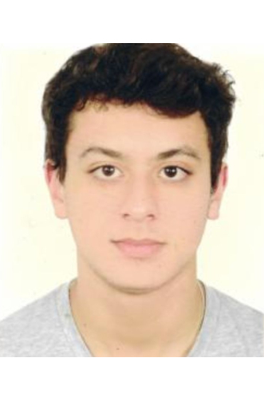

# ***CAPÍTULO I: INTRODUCCIÓN***
--------
## 1.1. Startup Profile
A continuación, procederemos a informar la solución del Equipo-4, así como la presentación del grupo de trabajo que lo conforma y la idea planteada como solución "TecHelp".
### 1.1.1. Descripción de la Startup
TecHelp, una solución innovadora, se distingue por su enfoque en la lógica y la creatividad en la resolución de problemas tecnológicos. Fundada por estudiantes y expertos en desarrollo de software de la Universidad Peruna de Ciencias Aplicadas (UPC), la empresa trabaja estrechamente con los clientes para entender sus necesidades comerciales y competitivas y así desarrollar soluciones específicas. Su objetivo es transformar la industria a través de su enfoque único y su compromiso con la excelencia técnica.

- **Misión:** Simplificar la complejidad tecnológica y convertir ideas en soluciones digitales impactantes, proporcionando software de alta calidad que agregue valor real a los proyectos y negocios de los clientes.

- **Visión:** Liderar el desarrollo de software y ser reconocida por su capacidad para enfrentar los desafíos tecnológicos más complejos, contribuyendo al progreso tecnológico y siendo el socio confiable de empresas y emprendedores que buscan soluciones de clase mundial.
### 1.1.2. Perfiles de integrantes del equipo
|Foto de Alumno|Nombre y Apellido|Código de Estudiante|Descripción de Carrera|Conocimientos Técnicos y Habilidades Aportantes|
|--------------|------------------|--------------------|----------------------|---------------------------------------------|
| |Manuel Alexis Vargas Quispe|u202113256|Estudiante de Ingeniería Sotfware|Tengo conocimiento en todo lo que tenga que ver con las codificaciones, conocimiento en app's como (Visual Code, Visual Studio, PacketTracer, AndroidStudio) - Todo lo aprendido hasta el momento en la carrera.|
| |Raúl Ronaldo Quispe Erasmo|u20211b682|Estudiante de Ingeniería Sotfware|Me considero una persona entusiasta y creativa, capaz de aportar varias ideas y conocimientos con el grupo. Cuento con buena experiencia en lenguajes de programación como C + +, HTML y CSS, además de un buen nivel de redacción. Me gusta socializar y siempre trato de mejorar como persona cada día.|
| |Santiago Olivera Guerra|U20201a821|Estudiante de Ingeniería Sotfware|Me caracterizo por mi entusiasmo y creatividad, los cuales me motivan a aportar una variedad de ideas y conocimientos en cualquier equipo en el que participe. Cuento con una amplia experiencia en programación, especialmente en lenguajes como C++, HTML y CSS, y soy reconocido por mi capacidad para redactar de forma clara y efectiva. Disfruto interactuar socialmente y siempre busco oportunidades para crecer y evolucionar como persona en todas las áreas de mi vida.|
| |Lorenzo Sebastian Navarro Robles|u201713141|Estudiante de Ingeniería Sotfware|Soy una persona enérgica y creativa, siempre impulsado por mi pasión y curiosidad innata. Me destaco por mi habilidad para aportar una diversidad de ideas y conocimientos en cualquier equipo al que pertenezco. Poseo una sólida trayectoria en el campo de la programación, especialmente en lenguajes como C++, HTML y CSS, donde he demostrado mi destreza y versatilidad. Además, soy reconocido por mi capacidad para comunicarme de manera clara y efectiva, lo que me permite transmitir ideas de manera convincente. Me encanta interactuar con otros y estoy constantemente buscando oportunidades para crecer y expandirme tanto personal como profesionalmente.|
## 1.2. Solution Profile
- **Nombre del producto:**
El nombre elegido para nuestro producto es "TecHelp", que combina "Tec" de técnico y "Help" de ayuda en inglés, transmitiendo la idea de "Ayuda Técnica" para atraer al público objetivo y hacer la aplicación más comercialmente viable.

- **Descripción del producto:**
"TecHelp" es una aplicación web que facilita la búsqueda y selección de centros técnicos para reparar teléfonos celulares. Permite filtrar resultados según necesidades y comentarios, brinda seguimiento del proceso de reparación y ofrece un panel de control para técnicos, así como la posibilidad para empresas de gestionar servicios de reparación para múltiples dispositivos.

- **Monetización:**
El servicio se ofrece de forma gratuita para usuarios finales, mientras que los técnicos pueden acceder a herramientas adicionales mediante una membresía mensual. Se planea establecer acuerdos con empresas para gestionar solicitudes de reparación a medida que la popularidad de la aplicación aumente.
### 1.2.1 Antecedentes y problemática

### 1.2.2 Lean UX Process

#### 1.2.2.1. Lean UX Problem Statements

#### 1.2.2.2. Lean UX Assumptions

#### 1.2.2.3. Lean UX Hypothesis Statements

#### 1.2.2.4. Lean UX Canvas

## 1.3. Segmentos objetivo
