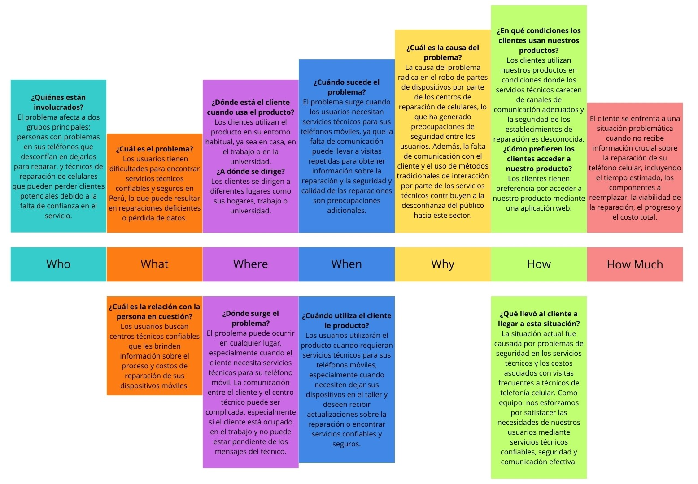
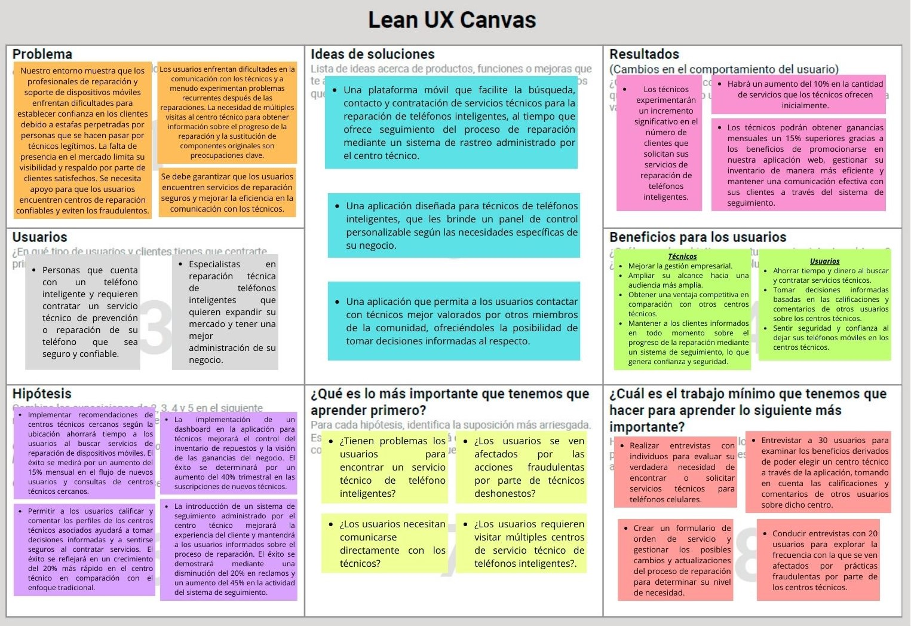
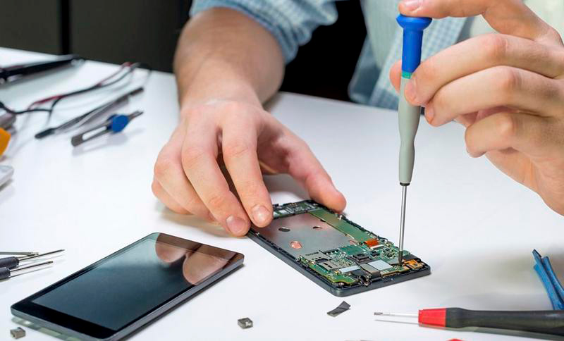

# ***CAPÍTULO I: INTRODUCCIÓN***
--------
## 1.1. Startup Profile
A continuación, procederemos a informar la solución del Equipo-4, así como la presentación del grupo de trabajo que lo conforma y la idea planteada como solución "TecHelp".
### 1.1.1. Descripción de la Startup
TecHelp, una solución innovadora, se distingue por su enfoque en la lógica y la creatividad en la resolución de problemas tecnológicos. Fundada por estudiantes y expertos en desarrollo de software de la Universidad Peruna de Ciencias Aplicadas (UPC), la empresa trabaja estrechamente con los clientes para entender sus necesidades comerciales y competitivas y así desarrollar soluciones específicas. Su objetivo es transformar la industria a través de su enfoque único y su compromiso con la excelencia técnica.

- **Misión:** Simplificar la complejidad tecnológica y convertir ideas en soluciones digitales impactantes, proporcionando software de alta calidad que agregue valor real a los proyectos y negocios de los clientes.

- **Visión:** Liderar el desarrollo de software y ser reconocida por su capacidad para enfrentar los desafíos tecnológicos más complejos, contribuyendo al progreso tecnológico y siendo el socio confiable de empresas y emprendedores que buscan soluciones de clase mundial.
### 1.1.2. Perfiles de integrantes del equipo
|Foto de Alumno|Nombre y Apellido|Código de Estudiante|Descripción de Carrera|Conocimientos Técnicos y Habilidades Aportantes|
|--------------|------------------|--------------------|----------------------|---------------------------------------------|
| |Manuel Alexis Vargas Quispe|u202113256|Estudiante de Ingeniería Sotfware|Tengo conocimiento en todo lo que tenga que ver con las codificaciones, conocimiento en app's como (Visual Code, Visual Studio, PacketTracer, AndroidStudio) - Todo lo aprendido hasta el momento en la carrera.|
| |Raúl Ronaldo Quispe Erasmo|u20211b682|Estudiante de Ingeniería Sotfware|Me considero una persona entusiasta y creativa, capaz de aportar varias ideas y conocimientos con el grupo. Cuento con buena experiencia en lenguajes de programación como C + +, HTML y CSS, además de un buen nivel de redacción. Me gusta socializar y siempre trato de mejorar como persona cada día.|
| |Santiago Olivera Guerra|U20201a821|Estudiante de Ingeniería Sotfware|Me caracterizo por mi entusiasmo y creatividad, los cuales me motivan a aportar una variedad de ideas y conocimientos en cualquier equipo en el que participe. Cuento con una amplia experiencia en programación, especialmente en lenguajes como C++, HTML y CSS, y soy reconocido por mi capacidad para redactar de forma clara y efectiva. Disfruto interactuar socialmente y siempre busco oportunidades para crecer y evolucionar como persona en todas las áreas de mi vida.|
| |Lorenzo Sebastian Navarro Robles|u201713141|Estudiante de Ingeniería Sotfware|Soy una persona enérgica y creativa, siempre impulsado por mi pasión y curiosidad innata. Me destaco por mi habilidad para aportar una diversidad de ideas y conocimientos en cualquier equipo al que pertenezco. Poseo una sólida trayectoria en el campo de la programación, especialmente en lenguajes como C++, HTML y CSS, donde he demostrado mi destreza y versatilidad. Además, soy reconocido por mi capacidad para comunicarme de manera clara y efectiva, lo que me permite transmitir ideas de manera convincente. Me encanta interactuar con otros y estoy constantemente buscando oportunidades para crecer y expandirme tanto personal como profesionalmente.|
## 1.2. Solution Profile
- **Nombre del producto:**
El nombre elegido para nuestro producto es "TecHelp", que combina "Tec" de técnico y "Help" de ayuda en inglés, transmitiendo la idea de "Ayuda Técnica" para atraer al público objetivo y hacer la aplicación más comercialmente viable.

- **Descripción del producto:**
"TecHelp" es una aplicación web que facilita la búsqueda y selección de centros técnicos para reparar teléfonos celulares. Permite filtrar resultados según necesidades y comentarios, brinda seguimiento del proceso de reparación y ofrece un panel de control para técnicos, así como la posibilidad para empresas de gestionar servicios de reparación para múltiples dispositivos.

- **Monetización:**
El servicio se ofrece de forma gratuita para usuarios finales, mientras que los técnicos pueden acceder a herramientas adicionales mediante una membresía mensual. Se planea establecer acuerdos con empresas para gestionar solicitudes de reparación a medida que la popularidad de la aplicación aumente.
### 1.2.1 Antecedentes y problemática
El uso de smartphones se ha vuelto esencial en la vida cotidiana, y durante la pandemia de Covid-19, su presencia en los hogares peruanos aumentó significativamente. Este incremento ha generado una mayor demanda de servicios técnicos para reparar y mantener estos dispositivos. Un estudio liderado por Amparo Babiloni evaluó los servicios técnicos de marcas como Xiaomi, Samsung, Motorola y BQ, encontrando diversos problemas de comunicación y servicio al cliente. En empresas como Claro, los usuarios enfrentaban dificultades para obtener información actualizada sobre el estado de sus dispositivos en el Servicio Técnico. La herramienta ClaroBot, diseñada para brindar información sobre el diagnóstico de dispositivos en reparación, reveló deficiencias en la comunicación al no guiar adecuadamente a los usuarios. Además, un caso observado en un canal de YouTube resaltó la falta de comunicación entre clientes y técnicos en reparaciones de teléfonos, enfatizando la importancia de la confianza en estos centros técnicos y la necesidad de comprender mejor las necesidades de los clientes. Para abordar estas deficiencias, se propone utilizar herramientas que promuevan una mejor comunicación y una conexión empática entre clientes y técnicos.

**The 5 ‘W’s y 2 ‘H’s:**

### 1.2.2 Lean UX Process
En esta sección, aplicaremos el enfoque del Lean UX Process para abordar los desafíos identificados en el campo de los servicios técnicos para dispositivos móviles. El Lean UX Process es una metodología centrada en la colaboración rápida y el aprendizaje iterativo para desarrollar productos y soluciones que satisfagan las necesidades del usuario de manera efectiva. A través de una serie de etapas que incluyen la identificación de problemas, la generación de soluciones y la validación con usuarios reales, buscamos mejorar la experiencia tanto para los clientes en busca de servicios técnicos como para los profesionales que los proporcionan.

A continuación, presentamos los Lean UX Problem Statements, donde delineamos los desafíos específicos que enfrentan los usuarios y los técnicos en el contexto de los servicios de reparación y soporte para dispositivos móviles, así como nuestras propuestas para abordarlos de manera efectiva.
#### 1.2.2.1. Lean UX Problem Statements
**Problema 1:** Los profesionales de reparación y soporte para dispositivos móviles tienen dificultades para generar confianza en los clientes debido a estafas frecuentes perpetradas por individuos malintencionados que se hacen pasar por técnicos legítimos. La falta de visibilidad en plataformas como sitios web o redes sociales limita su capacidad para recibir respaldo y recomendaciones de clientes satisfechos, lo que podría afectar negativamente la reputación y la viabilidad de sus negocios.

- **Pregunta clave:** ¿Cómo podemos apoyar a las personas que buscan servicios técnicos para sus smartphones a descubrir centros de reparación de celulares confiables y evitar aquellos que sean fraudulentos, asegurando así la reputación y el crecimiento de los negocios de los técnicos?

**Problema 2:** Los profesionales de reparación y soporte para dispositivos móviles enfrentan desafíos en la gestión de múltiples equipos de clientes, lo que puede resultar en una falta de organización durante el servicio. La carencia de un sistema eficiente para gestionar el orden de llegada de los dispositivos de los clientes impacta negativamente en la eficiencia del servicio, lo que podría afectar la satisfacción del cliente y la rentabilidad del negocio.

- **Pregunta clave:** ¿Cómo mejorar la eficiencia en la gestión de dispositivos de clientes para técnicos de reparación y soporte de celulares, garantizando así una experiencia de servicio fluida y satisfactoria para los clientes y optimizando la rentabilidad del negocio?

**Problema 3:** Los usuarios de servicios de reparación de teléfonos móviles encuentran dificultades en la comunicación con los técnicos, y los teléfonos reparados a menudo presentan problemas nuevamente debido a un servicio deficiente en el proceso de reparación. La necesidad de realizar múltiples visitas al centro técnico para obtener información sobre el progreso de la reparación de sus teléfonos celulares afecta la experiencia del usuario y puede generar frustración y desconfianza.

- **Pregunta clave:** ¿Cómo garantizar que los usuarios encuentren servicios de reparación de teléfonos celulares seguros, mejoren la eficiencia en la comunicación con los técnicos y obtengan reparaciones de calidad en la primera visita, mejorando así su experiencia y confianza en el servicio?
#### 1.2.2.2. Lean UX Assumptions
#### Suposiciones del Usuario:

1. **Usuarios Finales**:
   - **Quiénes son**: Personas que buscan servicios técnicos de reparación para sus dispositivos móviles y desean conocer la confiabilidad de las empresas de reparación.
   - **Necesidades y Desafíos**: Requieren encontrar servicios seguros y confiables de reparación, así como conocer comentarios y calificaciones para tomar decisiones informadas.
   - **Solución Propuesta**: Recibir recomendaciones de centros técnicos cercanos, valorados por otros usuarios, para una selección más segura y confiable.

2. **Técnicos en Reparación de Teléfonos Celulares**:
   - **Quiénes son**: Profesionales que buscan mejorar la gestión de su centro de labores, incluyendo inventario de productos y experiencia del cliente.
   - **Necesidades y Desafíos**: Necesitan una herramienta para gestionar su inventario y comunicarse eficientemente con los clientes, manteniéndolos informados sobre el proceso de reparación.
   - **Solución Propuesta**: Proporcionar un dashboard para control de inventario y un sistema de tracking para comunicación directa con los clientes.

#### Suposiciones de Negocio:

1. **Valor Principal para el Cliente**:
   - **Usuarios Finales**: Acceder a servicios técnicos de alta calidad y confianza, cerca de su ubicación, facilitando una selección segura y rápida.
   - **Técnicos en Reparación**: Ampliar su mercado y mejorar la gestión del negocio, generando confianza y comunicación efectiva con los clientes.

2. **Beneficios Adicionales para el Cliente**:
   - **Usuarios Finales**: Ahorro de tiempo al encontrar servicios de calidad rápidamente.
   - **Técnicos en Reparación**: Mayor flujo de clientes y mejor administración financiera.

3. **Modelo de Monetización**:
   - Suscripciones mensuales de afiliación para los centros técnicos.
   - Posible implementación de comisiones por transacciones realizadas a través de la aplicación.

#### Suposiciones de Usuario:

1. **Usuarios Finales**:
   - Utilizan la plataforma para encontrar servicios técnicos confiables y cercanos para reparar sus dispositivos móviles.
   - Integran la plataforma en su rutina diaria al buscar información sobre reparaciones y seguir el progreso de sus dispositivos en reparación.
   - Desean una imagen de la aplicación como una fuente confiable de información sobre servicios técnicos de reparación.

2. **Técnicos en Reparación**:
   - Utilizan la plataforma para promocionar su negocio y comunicarse con los clientes.
   - Integran la plataforma en su rutina laboral para gestionar el inventario y mantener a los clientes informados sobre el progreso de las reparaciones.

Estas suposiciones guiarán el diseño y desarrollo de la plataforma, asegurando que cumpla con las necesidades y expectativas de los usuarios finales y los técnicos en reparación de teléfonos celulares.

#### 1.2.2.3. Lean UX Hypothesis Statements
1. **Creemos** que al recomendar centros técnicos cercanos según la ubicación de consulta, se facilitará a las personas ahorrar tiempo al buscar y solicitar servicios de reparación de dispositivos móviles.

    **Sabremos** que hemos tenido éxito,

    **Cuando** el flujo de nuevos usuarios y las consultas de centros técnicos cercanos aumente en un 15% mensualmente.

2. **Creemos** que al implementar un dashboard en la aplicación para los usuarios con rol de técnico, estos podrán tener un mejor control de su inventario de repuestos y una visión más clara del flujo de ganancias de su negocio.

    **Sabremos** que hemos tenido éxito,

    **Cuando** la cantidad de suscripciones de nuevos técnicos que se unan a la aplicación aumente en un 40% trimestralmente.

3. **Creemos** que al administrar un sistema de seguimiento en el centro técnico, se mejorará la experiencia del técnico en sus servicios y se mantendrá a los clientes informados de manera oportuna sobre el proceso de reparación.

    **Sabremos** que hemos tenido éxito,

    **Cuando** la cantidad de reclamos disminuya en un 20% y el flujo de actividad en este aumente en un 45%.

4. **Creemos** que al permitir que los usuarios califiquen y comenten los perfiles de los centros técnicos asociados a la aplicación, se promoverá que los futuros usuarios tomen decisiones informadas y se sientan seguros al contratar un servicio en algún centro técnico.

    **Sabremos** que hemos tenido éxito,

    **Cuando** el crecimiento del centro técnico sea un 20% más rápido en comparación con el enfoque tradicional.
#### 1.2.2.4. Lean UX Canvas

## 1.3. Segmentos objetivo
Dentro de nuestros usuarios, encontramos dos perfiles distintos:
|Perfiles|Imágenes|
|---|--|
|**Usuarios:** Son aquellos que regularmente emplean teléfonos móviles y, en algunos casos, han sido víctimas de robos o estafas vinculadas a la reparación de sus dispositivos. Estos usuarios están en la búsqueda de soluciones confiables y seguras.||
|**Centros Técnicos:** Estos profesionales operan centros de reparación y poseen un alto nivel de especialización en la identificación y el uso de herramientas, suministros y equipamiento necesario para reparar dispositivos móviles. Nuestra plataforma les ofrece la flexibilidad necesaria para gestionar eficientemente sus órdenes de trabajo, brindando atención tanto en sus locales físicos como en línea.||
