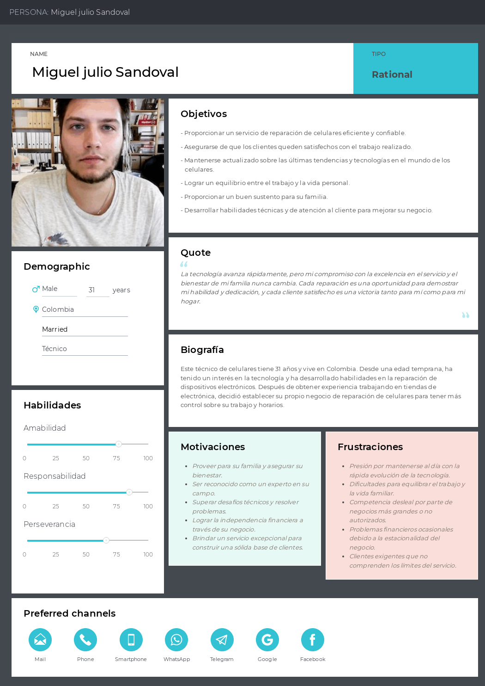

# ***CAPÍTULO II: REQUIREMENTS ELICITATION & ANALYSIS***
--------
## 2.1. Competidores
|EMPRESA|DESCRIPCIÓN|IMAGEN|
|-----|-----|----|
|**AyFix**|Es un servicio especializado en reparación y mantenimiento del hogar. Su enfoque principal es ofrecer soluciones rápidas y eficientes para problemas comunes en el hogar, como reparaciones eléctricas, plomería, carpintería, entre otros.||
|**Timbrit**|Se destaca por ser una plataforma que conecta a clientes con profesionales independientes para una variedad de servicios, incluyendo reparaciones del hogar, trabajos de construcción, jardinería, limpieza, entre otros. Su principal ventaja es la rapidez en encontrar ayuda confiable y cualificada.||
|**HelpErs**|Es una plataforma que proporciona asistentes y ayudantes para una amplia gama de tareas y necesidades, tanto en el hogar como en otros ámbitos. Su objetivo es brindar apoyo y asistencia personalizada a las personas, ya sea para tareas domésticas, cuidado de niños, compras, entre otros servicios.||

### 2.1.1. Análisis competitivo
<table>
<tr>
<th colspan="7">Landscape de Análisis Competitivo</th>
</tr>
<tr>
<td colspan="2" rowspan="2">¿Por qué llevar a cabo este análisis?</td>
<td colspan="5">El objetivo de este análisis es identificar las fortalezas y debilidades de cada competidor para desarrollar estrategias efectivas.</td>
</tr>
<tr>
<td colspan="5"></td>
</tr>
<tr>
<td colspan="3">(En la cabecera colocar por cada competidor nombre y logo)</td>
<td>TecHelp  </td>
<td>AyFix  </td>
<td>Timbrit  </td>
<td>Helpers  </td>
</tr>
<tr>
<td rowspan="2">PERFIL</td>
<td colspan="2">Resumen</td>
<td>Se trata de una aplicación móvil y plataforma web que gestiona servicios técnicos para la reparación de celulares, ofreciendo seguimiento de reparaciones y comentarios de clientes.</td>
<td>Es una aplicación móvil y plataforma web centrada en la reparación y mantenimiento de dispositivos electrónicos, con énfasis en el servicio a domicilio.</td>
<td>Plataforma web que conecta profesionales para servicios del hogar y cuidado personal, destacando por su comodidad y variedad de servicios.</td>
<td>Aplicación móvil y plataforma web para contactar profesionales del hogar, programar visitas y garantizar la competencia de los seleccionados.</td>
</tr>
<tr>
<td colspan="2">Propuesta de Valor ¿Qué beneficios ofrece a los clientes?</td>
<td>Ofrece seguimiento en tiempo real de reparaciones, comentarios de satisfacción y búsqueda de servicios técnicos de calidad.</td>
<td>Brinda comodidad, confiabilidad y eficiencia en reparaciones y mantenimiento, con servicio a domicilio.</td>
<td>Proporciona comodidad, variedad de servicios y profesionales verificados para el hogar y el cuidado personal.</td>
<td>Facilita el contacto con profesionales competentes para problemas del hogar desde cualquier ubicación.</td>
</tr>
<tr>
<td rowspan="2">PERFIL DE MARKETING</td>
<td colspan="2">Mercado objetivo</td>
<td>Usuarios en busca de servicios técnicos de reparación de celulares y técnicos que deseen expandir su mercado.</td>
<td>Profesionales en servicios del hogar y personas que requieren reparaciones y mantenimiento.</td>
<td>Propietarios de viviendas, pequeñas empresas y negocios locales que necesitan servicios para el hogar y el cuidado personal.</td>
<td>Usuarios que necesitan servicios para el hogar y buscan profesionales competentes.</td>
</tr>
<tr>
<td colspan="2">Estrategias de marketing</td>
<td>Publicidad en redes sociales, posicionamiento en Internet y colaboraciones con influencers.</td>
<td>Publicidad, posicionamiento web y entrevistas.</td>
<td>Marketing de contenido a través de blogs y videos.</td>
<td>Publicidad y posicionamiento web.</td>
</tr>
<tr>
<td rowspan="3">PERFIL DE PRODUCTO</td>
<td colspan="2">Productos & Servicios</td>
<td>Ofrece seguimiento de reparaciones de celulares, comentarios de satisfacción y búsqueda de servicios técnicos.</td>
<td>Proporciona una amplia gama de servicios para el hogar.</td>
<td>Ofrece contratación de servicios profesionales, gestión de citas y pagos.</td>
<td>Brinda servicios para problemas del hogar, la oficina o la empresa.</td>
</tr>
<tr>
<td colspan="2">Precios & Costos</td>
<td>Usuarios: Free Servicios tecnicos: Plan basico: S/. 0.00 Plan TechSOS: S/. 25 Plan avanzado: S/. 45.</td>
<td>El pago de una cuota fija mensual de 50 soles por parte de los profesionales en servicios del hogar.</td>
<td>Modelo de negocio basado en comisiones y tarifas por servicio.</td>
<td>Si un helper hace un servicio, cobran una comision de entre 17% y 22%, dependiendo de la categoria de servicio y el monto acordado.</td>
</tr>
<tr>
<td colspan="2">Canales de distribución (Web y/o Móvil)</td>
<td>Plataforma web y aplicación móvil.</td>
<td>Plataforma web y aplicación móvil.</td>
<td>Plataforma web y aplicación móvil.</td>
<td>Sitio web y WhatsApp.</td>
</tr>
<tr>
<td rowspan="5">ANÁLISIS SWOT</td>
<td colspan="6">Este análisis se realiza para su startup y sus competidores. Las fortalezas deben apoyar las oportunidades y contribuir a su posible ventaja competitiva.</td>
</tr>
<tr>
<td colspan="2">Fortalezas</td>
<td>Seguridad, confianza, calidad, garantía, cercanía, ahorro de tiempo y dinero para los clientes, y seguimiento en tiempo real de reparaciones.</td>
<td>Variedad de servicios para el hogar y profesionales capacitados.</td>
<td>Amplia cobertura geográfica y diversidad de servicios.</td>
<td>Reconocimientos en programas de startups.</td>
</tr>
<tr>
<td colspan="2">Debilidades</td>
<td>Falta de experiencia en el mercado.</td>
<td>Limitada cobertura geográfica.</td>
<td>Dependencia de la reputación de afiliados.</td>
<td>Falta de integración de funciones de contacto directo.</td>
</tr>
<tr>
<td colspan="2">Oportunidades</td>
<td>Mejora en la comunicación entre clientes y técnicos.</td>
<td>Crecimiento del mercado de servicios del hogar.</td>
<td>Innovación tecnológica y diversificación de servicios.</td>
<td>Abordar problemas domésticos recurrentes.</td>
</tr>
<tr>
<td colspan="2">Amenazas</td>
<td>Competencia con más experiencia.</td>
<td>Cambios en la demanda del mercado.</td>
<td>Opiniones negativas de los clientes.</td>
<td>Problemas de calidad en el servicio.</td>
</tr>
</table>

### 2.1.2. Estrategias y tácticas frente a competidores
| Matriz F.O.D.A. y C.A.M.E. | Oportunidades El mercado cuenta con una amplia base de clientes potenciales. Los servicios técnicos tienen necesidades de organización. | Amenazas Presencia de competidores reconocidos. Competidores con una larga trayectoria en el mercado. |
| - | - | - |
| Fortalezas Concepto innovador. Diseño intuitivo y adaptable a múltiples plataformas. Gratuidad para los usuarios. Tarifas asequibles para los servicios técnicos asociados. | Estrategia Ofensiva Implementar un chat de comunicación con técnicos que sea fácil e interactivo, mejorando la experiencia del usuario. Garantizar la compatibilidad de la plataforma con diversos sistemas operativos como Android, iOS y versión web para ampliar su accesibilidad. Explorar diferentes modelos de precios basados en el número de servicios técnicos afiliados. | Estrategia Defensiva Investigar y perfeccionar la idea innovadora para diferenciarse de productos similares, como los de Apple. Desarrollar interfaces para varios sistemas operativos, en contraposición a otras empresas que se centran en una sola plataforma. |
| Debilidades Falta de experiencia en el mercado. Conocimiento limitado en algunas áreas tecnológicas. | Estrategia de Reorientación Aprovechar la gran cantidad de usuarios del mercado para validar y mejorar el diseño del producto. Adquirir conocimientos sobre las necesidades de los técnicos y diseñar la plataforma teniendo en cuenta las tecnologías necesarias para facilitar su uso tanto para técnicos como para usuarios. | Estrategia de Supervivencia Lanzar campañas de marketing destacando nuestra propuesta única que agrega valor tanto para clientes como para técnicos. |

Nota: Este cuadro presenta la matriz C.A.M.E., utilizada para planificar acciones basadas en el análisis de fortalezas, debilidades, oportunidades y amenazas.
## 2.2. Entrevistas
En esta sección, entrevistaremos a parte de nuestro público objetivo para asi tener más de cerca algunos testimonios y poder trabajar en base a ellos.

### 2.2.1. Diseño de entrevistas

### 2.2.2. Registro de entrevistas
|***Entrevista***|***1***|
|---------|----------|
|Nombre completo|Miguel Huarcaya Chavez|
|Edad|22 años|
|Distrito|Villa el Salvador|
|Screenshot de video||
|URL del video|[Link Entrevista](https://upcedupe-my.sharepoint.com/:v:/g/personal/u202113256_upc_edu_pe/EZTp1-pO-yBEuzwcpbw1UBgBQU1c4L9ECuThnbLOygbvvQ?nav=eyJyZWZlcnJhbEluZm8iOnsicmVmZXJyYWxBcHAiOiJPbmVEcml2ZUZvckJ1c2luZXNzIiwicmVmZXJyYWxBcHBQbGF0Zm9ybSI6IldlYiIsInJlZmVycmFsTW9kZSI6InZpZXciLCJyZWZlcnJhbFZpZXciOiJNeUZpbGVzTGlua0NvcHkifX0&e=YvzJBh)|
|Entrevista entre los minutos|05:21 - 18:00|
|Resumen de la entrevista|Miguel, técnico de celulares, tuvo problemas con los clientes que desconocen temas de la tecnología de celulares y reconocimiento de su local. Quiere prosperidad en su emprendimiento con más clientes y reconocimientos al confiar en la aplicación.|
|Tipo de Usuario|Técnico|

|**`PREGUNTAS PRINCIPALES`**|
|---|
|Miguel, un técnico de 21 años de Villa el Salvador, enfrenta retos en su negocio de reparación de celulares, trabajando con un ayudante en su local y gestionando unas tres solicitudes de servicio diarias. A veces le resulta difícil administrar el tiempo, especialmente con clientes mayores que requieren explicaciones adicionales sobre los problemas de sus dispositivos, pero organiza sus tareas por urgencia y comunica plazos con claridad. Manteniendo actualizado su inventario de piezas, se enfrenta a problemas comunes como pantalla, batería y software, así como desafíos más grandes relacionados con daños internos. Establece precios considerando costos y esfuerzos, aceptando efectivo y transferencia bancaria, y se compromete a resolver problemas insatisfactorios, priorizando la seguridad durante las reparaciones y promoviendo la confianza, transparencia y calidad en el servicio ofrecido. Aunque desconoce otras plataformas similares, considera que TechHelp podría mejorar su negocio y satisfacer a sus clientes con un sistema de seguimiento del estado de las reparaciones y una función de calificación para los técnicos.|

|***Entrevista***|***2***|
|---------|----------|
|Nombre completo|Gabriela Avril Zavala Perez|
|Edad|21 años|
|Distrito|Surco|
|Screenshot de video||
|URL del video|[Link Entrevista](https://upcedupe-my.sharepoint.com/:v:/g/personal/u202113256_upc_edu_pe/EZTp1-pO-yBEuzwcpbw1UBgBQU1c4L9ECuThnbLOygbvvQ?nav=eyJyZWZlcnJhbEluZm8iOnsicmVmZXJyYWxBcHAiOiJPbmVEcml2ZUZvckJ1c2luZXNzIiwicmVmZXJyYWxBcHBQbGF0Zm9ybSI6IldlYiIsInJlZmVycmFsTW9kZSI6InZpZXciLCJyZWZlcnJhbFZpZXciOiJNeUZpbGVzTGlua0NvcHkifX0&e=YvzJBh)|
|Entrevista entre los minutos|00:00 - 05:20|
|Resumen de la entrevista|Gabriela, estudiante de derecho, tuvo problemas con su pantalla durante la pandemia. Buscó un técnico para arreglarlo y en una entrevista destaca la importancia de encontrar precios claros y confianza en el técnico dentro de la aplicación.|
|Tipo de Usuario|Cliente|

|**`PREGUNTAS PRINCIPALES`**|
|---|
|Gabriela Avril Zavala Perez, una estudiante de derecho de 21 años residente en Surco, ejerce como técnica de reparación de dispositivos móviles, manejando unas tres solicitudes de servicio diarias. Prioriza las reparaciones según su urgencia y mantiene una comunicación clara con los clientes sobre los plazos de entrega, mientras asegura que su inventario esté actualizado. Enfrenta problemas comunes como pantalla, batería y errores de software, así como desafíos mayores como fallos en la placa base. Se compromete a brindar un servicio excepcional, ofreciendo soluciones alternativas o reembolsos en caso de insatisfacción, y garantiza la seguridad de los dispositivos durante las reparaciones. Considera que la confianza, la transparencia en los precios y la calidad del trabajo son esenciales para el éxito, y encuentra satisfacción en resolver problemas técnicos y ayudar a sus clientes.|

|***Entrevista***|***3***|
|---------|----------|
|Nombre completo|Elias Torres Espinoza|
|Edad|23 años|
|Distrito|Villa el Salvador|
|Screenshot de video||
|URL del video|[Link Entrevista](https://upcedupe-my.sharepoint.com/:v:/g/personal/u202113256_upc_edu_pe/EZTp1-pO-yBEuzwcpbw1UBgBQU1c4L9ECuThnbLOygbvvQ?nav=eyJyZWZlcnJhbEluZm8iOnsicmVmZXJyYWxBcHAiOiJPbmVEcml2ZUZvckJ1c2luZXNzIiwicmVmZXJyYWxBcHBQbGF0Zm9ybSI6IldlYiIsInJlZmVycmFsTW9kZSI6InZpZXciLCJyZWZlcnJhbFZpZXciOiJNeUZpbGVzTGlua0NvcHkifX0&e=YvzJBh)|
|Entrevista entre los minutos|18:01 - 30:10|
|Resumen de la entrevista|Elías, estudiante de 23 años de Villa el Salvador, recalca la importancia de elegir técnicos especializados tras una mala experiencia con reparaciones baratas. Destaca la necesidad de invertir en calidad para evitar problemas futuros en dispositivos móviles.|
|Tipo de Usuario|Cliente|

|**`PREGUNTAS PRINCIPALES`**|
|---|
|Elias Torres Espinoza, un estudiante universitario de 23 años residente de Villa el Salvador, comparte su experiencia en el ámbito de la reparación de dispositivos móviles. En un incidente pasado, necesitó reparar la pantalla de su celular y optó por un técnico más económico, pero el reemplazo resultó ser de baja calidad, lo que ocasionó que el problema reapareciera. Siguiendo la recomendación de un amigo, acudió a un centro de reparación en el centro de Lima, donde, a pesar del costo mayor, quedó satisfecho con el servicio y no ha tenido problemas desde entonces. Aunque no ha tenido problemas con su celular desde entonces, Elias ha recurrido al mismo técnico dos veces para reparaciones de su laptop, destacando su buena experiencia. Para problemas simples, intenta resolverlos por sí mismo, pero recurre a técnicos especializados para situaciones más complejas, como el reemplazo de la pantalla. Prefiere técnicos con disponibilidad inmediata cuando hay largas esperas en otros lugares y evita dejar su celular por más de dos horas para reparaciones. Considera que pagar un precio justo es preferible a opciones más económicas, ya que lo barato puede resultar costoso a largo plazo. Recibió una garantía de tres meses después de la reparación, pero solo para problemas relacionados con la pantalla. Aunque no ha tenido problemas posteriores a la reparación de su celular, menciona una mala experiencia de su padre debido a una reparación económica ineficaz. Al elegir un técnico, considera esencial la especialización y el uso de piezas exactas, especialmente para dispositivos Android o iOS de marcas específicas como Huawei, Samsung o iPhone.|

|***`CONCLUSIONES GENERALES`***|
|---|
|En todos los casos analizados, los usuarios han recurrido a técnicos para reparar sus celulares, experimentando diferentes niveles de atención y satisfacción. La mayoría de los usuarios no intentan resolver los problemas por sí mismos debido a la falta de conocimientos técnicos. Factores importantes en la elección de un técnico incluyen la calidad de la atención y del servicio, así como las recomendaciones de familiares y amigos. La falta de garantía post-reparación es una preocupación común entre los usuarios. Aunque los costos de reparación varían, en general los usuarios consideran que son justos. Existe una demanda por un servicio más transparente y una comunicación efectiva con los técnicos.|
||
|En todos los casos analizados, los usuarios han recurrido a técnicos para reparar sus celulares, experimentando diferentes niveles de atención y satisfacción. La mayoría de los usuarios no intentan resolver los problemas por sí mismos debido a la falta de conocimientos técnicos. Factores importantes en la elección de un técnico incluyen la calidad de la atención y del servicio, así como las recomendaciones de familiares y amigos. La falta de garantía post-reparación es una preocupación común entre los usuarios. Aunque los costos de reparación varían, en general los usuarios consideran que son justos. Existe una demanda por un servicio más transparente y una comunicación efectiva con los técnicos.|
|***`ESTADÍSTICA GENERAL DEL SECTOR OBJETIVO`***|
|El 100% de los usuarios encuestados han recurrido a técnicos para reparar sus celulares. La satisfacción promedio con la atención del técnico es del 50%, con un 50% de usuarios satisfechos y un 50% insatisfechos. Ningún usuario intentó solucionar el problema por sí mismo. El 100% de los usuarios utilizan recomendaciones para elegir un técnico. El 100% de los usuarios no recibieron garantía después de la reparación. El rango de costo promedio de reparación es de 20 a 150 soles. El 100% de los usuarios no conocen una aplicación web similar. Las principales mejoras deseadas en la aplicación incluyen una mejor comunicación con el técnico, mayor transparencia en precios y tiempos de reparación, y la posibilidad de publicar fotos en los comentarios.|
||
|- El 100% de los usuarios encuestados han recurrido a técnicos para reparar sus celulares.   - La satisfacción promedio con la atención del técnico es del 50%, con un 50% de usuarios satisfechos y un 50% insatisfechos.   - Ningún usuario intentó solucionar el problema por sí mismo.   - El 100% de los usuarios utilizan recomendaciones para elegir un técnico.   - El 100% de los usuarios no recibieron garantía después de la reparación.   - El rango de costo promedio de reparación es de 20 a 150 soles.   - El 100% de los usuarios no conocen una aplicación web similar.   - Las principales mejoras deseadas en la aplicación incluyen una mejor comunicación con el técnico, mayor transparencia en precios y tiempos de reparación, y la posibilidad de publicar fotos en los comentarios.|

### 2.2.3. Análisis de entrevistas
|**`SEGMENTO OBJETIVO TÉCNICO(Miguel Huarcaya Chavez)`**|
|---|
|Miguel Huarcaya Chavez, un técnico de 21 años de Villa el Salvador, demuestra un enfoque centrado en el cliente y la calidad en su negocio de reparación de celulares. A través de su dedicación y compromiso, gestiona eficientemente las solicitudes de servicio, comunicando claramente los plazos y priorizando las reparaciones según su urgencia. Reconociendo los problemas comunes en los dispositivos, mantiene un inventario actualizado y establece precios justos, considerando tanto costos como esfuerzos. Su compromiso con la satisfacción del cliente se refleja en su disposición para rectificar cualquier insatisfacción y garantizar la seguridad durante las reparaciones. Además, muestra una actitud proactiva hacia la mejora de su negocio al considerar nuevas plataformas como TechHelp, sugiriendo características adicionales para satisfacer las necesidades de sus clientes y mejorar su servicio.|

|**`SEGMENTO OBJETIVO CLIENTE(Avril Zavala Perez/Elias Torres Espinoza )`**|
|---|
|Tanto Gabriela Avril Zavala Perez como Elias Torres Espinoza coinciden en que la calidad del servicio y la confianza en el técnico son elementos fundamentales al decidir dónde reparar sus dispositivos. Ambos han experimentado la importancia de elegir un servicio confiable, habiendo tenido experiencias negativas con técnicos que no cumplieron con sus expectativas. Para ellos, pagar un precio justo por un servicio de calidad es preferible a opciones más económicas que puedan resultar en problemas futuros. Además, valoran la especialización del técnico y el uso de piezas exactas en las reparaciones, así como la garantía ofrecida después del servicio, lo que indica una preocupación por la satisfacción del cliente por parte del técnico. En resumen, la calidad, confianza y garantía son los principales criterios que influyen en la elección de un técnico para la reparación de dispositivos móviles.|

## 2.3. Needfinding
En esta sección se presentarán los resultados del proceso de recolección de información llevado a cabo en los segmentos objetivo, culminando en la elaboración de User Personas, User Task Matrix, User Journey Maps, Empathy Mapping y As-Is Scenario Mapping.

### 2.3.1. User Personas
Esta sección del informe presenta perfiles ficticios basados en grupos de interés entrevistados. Contienen información demográfica, personalidad, motivaciones, preferencias, objetivos, desafíos y patrones de comportamiento, respaldados por entrevistas previas y elaborados con UXPressia.

|**`USER EMPATHY MAPPING: TÉCNICO`**|
|---|
||

|**`USER EMPATHY MAPPING: CLIENTE`**|
|---|
||

### 2.3.2. User Task Matrix
En User Task Matrix, hemos detectado las acciones llevadas a cabo por nuestros dos grupos y hemos evaluado la relevancia de cada una de estas actividades para cada grupo. 
                     
<table>
    <thead>
        <tr>
            <th>Segmento objetivo</th>
            <th colspan="2">Julia Alejandra Carbajal - Cliente</th>
            <th colspan="2">Miguel Julio Sandoval - Técnico</th>
        </tr>
    </thead>
    <tbody>
        <tr>
            <th>Tareas</th>
            <th>Frecuencia</th>
            <th>Importancia</th>
            <th>Frecuencia</th>
            <th>Importancia</th>
        </tr>
        <tr>
            <td>Buscar un sitio con buenos técnicos</td>
            <td>Siempre</td>
            <td>Media</td>
            <td>Rara vez</td>
            <td>Media</td>
        </tr>
        <tr>
            <td>Elegir un técnico confiable</td>
            <td>Siempre</td>
            <td>Alta</td>
            <td>Nunca</td>
            <td>Media</td>
        </tr>   
        <tr>
            <td>Considerar que componente usar para la reparación</td>
            <td>Rara vez</td>
            <td>Media</td>
            <td>Siempre</td>
            <td>Alta</td>
        </tr>  
        <tr>
            <td>Recoger el celular reparado</td>
            <td>Siempre</td>
            <td>Alta</td>
            <td>A menudo</td>
            <td>Alta</td>
        </tr>  
        <tr>
            <td>Comprar los componentes para reparar el celular</td>
            <td>Rara vez</td>
            <td>Alta</td>
            <td>Siempre</td>
            <td>Alta</td>
        </tr>  
        <tr>
            <td>Determinar problema de celular </td>
            <td>Rara vez</td>
            <td>Alta</td>
            <td>Siempre</td>
            <td>Alta</td>
        </tr>  
        <tr>
            <td>Reparar celular </td>
            <td>Nunca</td>
            <td>Alta</td>
            <td>Siempre</td>
            <td>Alta</td>
        </tr>  
        <tr>
            <td>Entregar celular a tiempo </td>
            <td>Nunca</td>
            <td>Alta</td>
            <td>A veces</td>
            <td>Alta</td>
        </tr>  
        <tr>
            <td>Determinar precio de reparación</td>
            <td>Nunca</td>
            <td>Baja</td>
            <td>Siempre</td>
            <td>Alta</td>
        </tr>      
    </tbody>
</table>  

Mediante el User Task Matrix, podemos discernir las frecuencias y relevancias entre las distintas Personas del Usuario que presentamos, lo cual nos proporciona una guía útil.

### 2.3.3. User Journey Mapping
En esta sección, se detallan los mapas de viaje del usuario para cada persona del usuario, cliente y técnico. Se describen los pasos desde la búsqueda de un técnico hasta la recolección del dispositivo reparado, destacando metas, desafíos y procesos clave desde la perspectiva del cliente. Desde el punto de vista del técnico, se enfoca en atraer clientes, diagnosticar y brindar servicios de reparación con el objetivo de crear una experiencia positiva y ganar confianza.
|**`USER JOURNEY MAPPING: TÉCNICO`**|
|---|
||

|**`USER JOURNEY MAPPING: CLIENTE`**|
|---|
||

### 2.3.4. Empathy Mapping
Esta sección presenta el mapeo de empatía para los segmentos de cliente y técnico, ofreciendo una visión detallada de las necesidades, preocupaciones y beneficios desde la perspectiva del usuario. Esto facilita la creación de perfiles detallados y contribuye a desarrollar un artefacto centrado en las necesidades reales, crucial para el proceso de Needfinding.
|**`AS-IS SCENARIO MAPPING: TÉCNICO`**|
|---|
||

|**`AS-IS SCENARIO MAPPING: CLIENTE`**|
|---|
||

### 2.3.5. As-is Scenario Mapping

## 2.4. Ubiquitous Language
