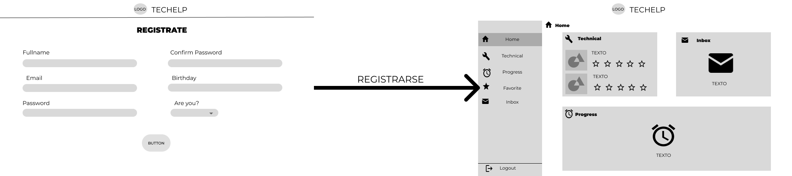
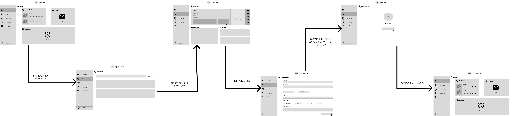
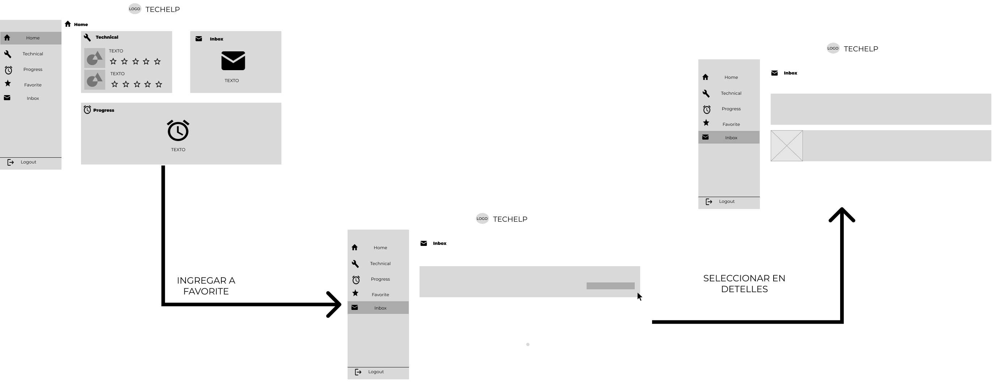
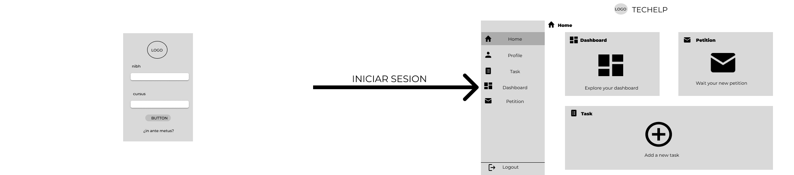
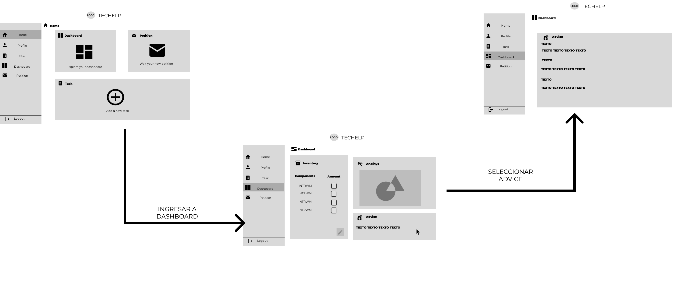
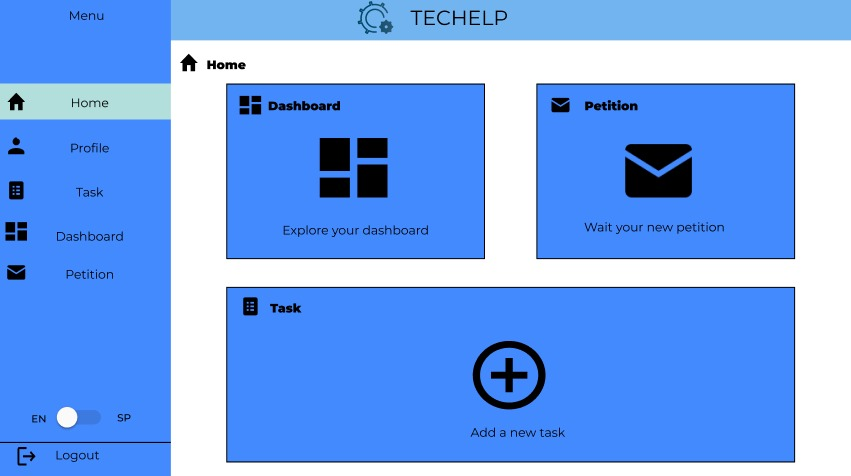
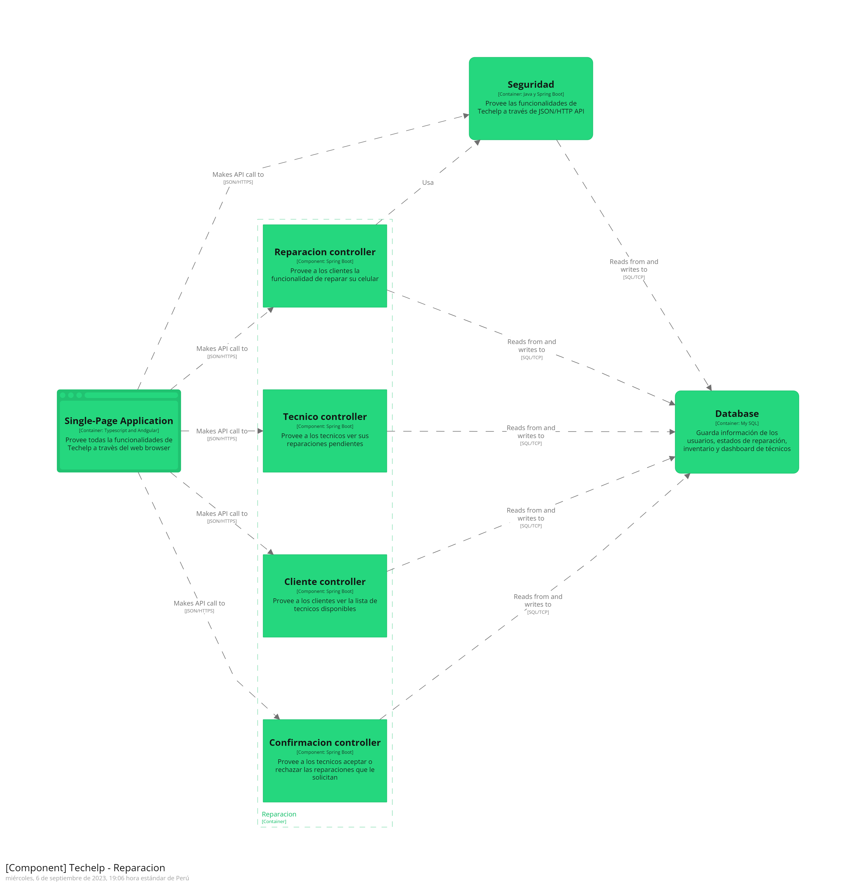
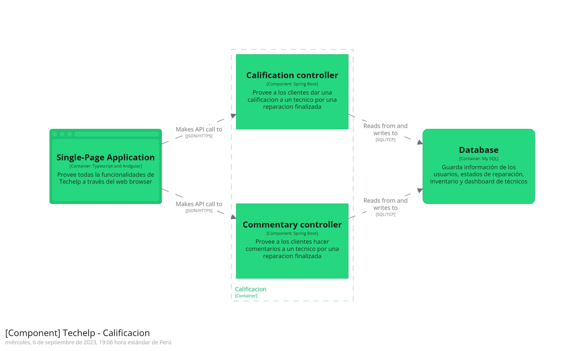

# ***CAPÍTULO IV: PRODUCT DESIGN***
--------
## 4.1. Style Guidelines
El manual de estilo visual define directrices para la coherencia en assets, tipografías y colores en la versión web y móvil, asegurando una identidad visual sólida y mejorando la experiencia del usuario.
### 4.1.1. General Style Guidelines

|**`TIPOGRAFIA`**|
|---|
|La tipografía utilizada en el trabajo es moderna y legible, diseñada para facilitar la lectura y la comprensión. Su estilo limpio y profesional refleja claridad y precisión, características esenciales para la presentación de información técnica y detallada. La selección de esta tipografía busca equilibrar la estética con la funcionalidad, asegurando que los lectores puedan seguir el contenido de manera fluida y sin distracciones.|
||

|**`BRAND NAME`**|
|---|
|El nombre que hemos elegido para nuestra solución es Techelp. Este nombre surge al observar la creciente necesidad de las personas de contar con un buen servicio técnico para sus dispositivos móviles. Techelp fusiona las palabras "tecnología", representando los dispositivos móviles, y "ayuda", refiriéndose al servicio que ofrecemos. Esta fusión refleja nuestra misión de brindar asistencia tecnológica de calidad. Además, la elección del inglés como idioma refuerza su carácter universal y comercial para los usuarios.|
||

|**`TYPOGRAPHY`**|
|---|
|La elección de la tipografía es crucial para organizar los diversos contenidos de nuestras páginas en distintos niveles. Además, una tipografía amigable puede captar la atención del usuario y guiarlo a través de nuestra interfaz de manera efectiva.|
||

|**`SPACING`**|
|---|
|El diseño basado en múltiplos de 8 píxeles es una metodología que se enfoca en la utilización de una unidad de medida estándar, 8 píxeles, para definir todos los elementos y espacios dentro de una interfaz de usuario. Este enfoque se inspira en principios de diseño modular y escalabilidad, permitiendo una estructura visual coherente y un flujo más natural para el usuario.|
||

<table>
  <tr>
    <th>Color Primario Azul</th>
    <th>Color secundario azul-verdoso</th>
    <th>Color estado: Rojo - (Acción inconclusa o incorrecta)</th>
  </tr>
  <tr>
    <td>El color azul siempre hace alusión a dos cosas: la tecnología y el bienestar. Con ese enfoque, damos a entender al usuario que será nuestra aplicación web. Además, se sabe que el azul genera serenidad y calma en las personas, lo cual queremos lograr con el usuario.</td>
    <td>Se eligió por su impacto, su tranquilidad y paz que transmite a los usuarios, pero sobre todo la confianza, lo cual es primordial que deseamos mostrar en nuestra aplicación.</td>
    <td>Se usa el rojo para este estado debido a que el usuario identificará rápidamente la acción que cometió de manera errónea.</td>
  </tr>
  <tr>
    <td style="text-align: center;"></td>
    <td style="text-align: center;"></td>
    <td style="text-align: center;"></td>
  </tr>
  <tr>
    <th>Color estado: Verde (Acción exitosa)</th>
    <th>Color estado: Amarillo (Advertencia de una acción)</th>
    <th>Color Estado: Gris (Botón o Acción deshabilitada)</th>
  </tr>
  <tr>
    <td>Se consideró el verde como color de este estado debido a que el usuario ya está familiarizado con este color y sabrá que la acción fue exitosa de manera inmediata.</td>
    <td>Se eligió el color amarillo para este estado debido a que siempre se ha usado para advertir al usuario si está cometiendo una acción que afectará a futuro las actividades que realice.</td>
    <td>Se usa este color gris para mostrar al usuario que la acción o botón está deshabilitado, ya que deberá completar otras acciones posteriormente para poder habilitarlo.</td>
  </tr>
  <tr>
    <td style="text-align: center;"></td>
    <td style="text-align: center;"></td>
    <td style="text-align: center;"></td>
  </tr>
</table>

### 4.1.2. Web Style Guidelines
- Desarrollaremos un sitio web adaptable que garantice una experiencia de usuario óptima en cualquier dispositivo, manteniéndose siempre claro y visualmente atractivo. Nuestra aplicación web se ajustará a las resoluciones comúnmente utilizadas en los diversos dispositivos actuales.
- Utilizaremos el patrón Z para el diseño, de modo que los usuarios comiencen la navegación de nuestra landing page y aplicación web visualizando el logo en la esquina superior izquierda. Luego, sus ojos se moverán hacia la derecha donde encontrarán las diferentes opciones de navegación. Después, descenderán verticalmente para ver el contenido principal de la página. Finalmente, se desplazarán horizontalmente hacia la derecha para encontrar información sobre nuestra startup y los detalles de contacto.

## 4.2. Information Architecture
La Arquitectura de la Información busca simplificar la navegación y búsqueda de información en nuestras plataformas, mediante la organización, etiquetado y navegación fluida. Aspiramos a una experiencia intuitiva que atienda eficazmente las necesidades de nuestros usuarios.
### 4.2.1. Organization Systems

### 4.2.2. Labeling Systems
En esta sección, el equipo presentará la estructura de etiquetado que utilizará nuestra página de inicio.

* **Inicio/Home:** Sección inicial destacada que presentará un banner con un mensaje representativo, proporcionando una idea principal y un botón para acceder a la aplicación.
* **Servicios/Service:** Sección dividida por cada segmento, donde se mostrarán los beneficios específicos de cada uno al utilizar la aplicación.
* **Membresía/Membership:** Sección que exhibirá los precios de las membresías para los técnicos, junto con los beneficios que obtendrán al adquirirlas.
* **Contactanos/Contact Us:** Aquí se mostrarán nuestros canales de comunicación, además de un formulario para que los usuarios puedan enviarnos sus comentarios.
* **Nosotros/ About Us:** Los usuarios podrán encontrar aquí información sobre el equipo que trabaja en la aplicación.

A continuación, el equipo de trabajo presentará la estructura de etiquetado que utilizará nuestra aplicación web para ambos segmentos.

|**`SEGMENTO 1: USUARIOS QUE BUSCAN SERVICIOS DE TÉCNICOS CALIFICADOS`**|
|---|
|- **Inicio/Home:** Sección principal que ofrece una vista general del progreso de reparación de sus dispositivos, una lista de técnicos disponibles y la bandeja de entrada. Estas secciones proporcionan una visión general, invitando al usuario a explorar más detalles en otras secciones.   - **Progreso de Reparación/ Progress:** Aquí, los usuarios pueden verificar el estado actual de reparación de sus dispositivos, facilitando el proceso de recogida una vez completada la reparación.  - **Técnicos / Technical:** Sección que presenta una lista organizada de técnicos, priorizando a aquellos con mejor calificación. Los usuarios pueden filtrar los técnicos según su experiencia, calificación y coste, y también disponen de una función de búsqueda para encontrar técnicos específicos.  - **Favoritos/ Favorite:** En esta sección, los usuarios pueden ver a los técnicos marcados como favoritos, simplificando la búsqueda si desean volver a contactar con ellos en el futuro.  - **Bandeja de entrada/Inbox:** Aquí, los usuarios pueden revisar todas las solicitudes de servicio aceptadas por los técnicos a quienes contactaron previamente.  |
||
|**`SEGMENTO 2: TÉCNICOS DE CELULARES`**|
|- **Inicio/Home:** Sección principal que presenta un resumen de las tareas en curso, el dashboard y los pedidos pendientes. Estas secciones ofrecen una visión general, invitando al técnico a explorar más detalles en otras secciones.   - **Perfil/Profile:** Aquí, el técnico puede ver su perfil y los comentarios recibidos, además de poder actualizar su información personal.  - **Tareas/Task:** Sección donde el técnico puede crear tareas como recordatorio de los servicios que está realizando, incluyendo la fecha límite y los detalles del problema a solucionar.  - **Pedidos/Request:** Bandeja de entrada donde el técnico puede revisar y aceptar o rechazar las citas solicitadas por los clientes.  - **Panel de Control/Dashboard:** En este apartado, el técnico encontrará herramientas para gestionar su negocio. Se incluye un inventario de componentes y estadísticas de ingresos mensuales y semanales para su análisis. |

### 4.2.3. SEO Tags and Meta Tags

|**`SEO TAGS AND META TAGS`**|
|---|
|Esta etiqueta se emplea para definir la codificación de caracteres del documento HTML. Facilita a los motores de búsqueda y navegadores la interpretación adecuada de los caracteres especiales, asegurando la correcta representación del texto en diversos idiomas.|
||
||
|Esta etiqueta indica al navegador que utilice la última versión de Internet Explorer (o el modo de emulación Edge) para representar la página. Esto ayuda a asegurar la compatibilidad y una representación adecuada en navegadores antiguos de Internet Explorer.|
||
||
|Esta etiqueta es fundamental para el diseño web receptivo (responsive design). En particular, especifica que el ancho del viewport debe ser igual al ancho del dispositivo y que la escala inicial debe ser 1.0. Esto contribuye a optimizar la visualización en dispositivos móviles.|
||
||
|Esta etiqueta meta se emplea para especificar palabras clave relacionadas con el contenido del sitio web.|
||
||
|Esta etiqueta meta proporciona una breve descripción del contenido de la página. La descripción meta se muestra en los resultados de búsqueda de Google y otros motores de búsqueda.|
||
||
|La etiqueta title se emplea para definir el título de la página, lo cual es crucial para el SEO. Este título aparece en la barra de título del navegador y es uno de los factores más importantes para el posicionamiento en motores de búsqueda.|
||
||
|`En resumen, estas etiquetas y meta tags se utilizan para mejorar la optimización de motores de búsqueda y la experiencia del usuario en el sitio web TecHelp, al definir la codificación, la compatibilidad del navegador, el diseño receptivo, el título de la página, las palabras clave y la descripción del contenido.`|

### 4.2.4. Searching Systems
Para mejorar la experiencia del usuario, la aplicación TechHelp contará con un sistema de búsqueda intuitivo. Este sistema permitirá a los usuarios encontrar productos de manera eficiente, como periféricos y componentes de computadora, sin sentirse abrumados por el exceso de información.

- **Búsqueda en la Página Principal:** Al aterrizar en la página principal, los usuarios verán la barra de búsqueda prominentemente.
- **Búsquedas Filtradas:** Los usuarios que buscan componentes técnicos específicos pueden utilizar los filtros para una experiencia de búsqueda más personalizada.
- **Beneficios para Miembros:** Los miembros, especialmente aquellos en el Plan Platinum, pueden tener acceso a funciones avanzadas de búsqueda, como búsquedas guardadas y recomendaciones personalizadas.

### 4.2.5. Navigation Systems
Nuestra página de inicio será la primera impresión que reciban los usuarios. Aquí podrán registrarse o iniciar sesión fácilmente, gracias a un diseño claro y sencillo que facilita la navegación.

1. **Proceso de Inicio de Sesión:**
- **Registro/Iniciar Sesión:** Los usuarios podrán registrarse o iniciar sesión sin complicaciones.
- **Redirección:** Una vez iniciada la sesión, los usuarios serán redirigidos a la página principal de la aplicación, donde podrán comenzar a utilizar nuestros servicios.
2. **Interacción del Usuario:**
- **Navegación Intuitiva:** Los usuarios podrán interactuar con los diferentes botones disponibles en la página, los cuales los llevarán a distintas secciones internas de nuestro sitio web.
- **Acceso Permanente:** El servicio estará disponible las 24 horas del día, permitiendo a los usuarios acceder en cualquier momento según sus necesidades.
3. **Proceso de Pago:**
- **Facilidad de Uso:** Los usuarios podrán ofrecer sus productos como parte de pago a través de un proceso muy sencillo, garantizando una experiencia satisfactoria.

## 4.3. Landing Page UI Design
En esta sección, el equipo presenta la propuesta de UI para el Landing Page, destacando cómo traducen las decisiones de diseño y arquitectura de información en una experiencia de usuario cohesiva y eficaz.
### 4.3.1. Landing Page Wireframe
En esta sección se mostrará el desarrollo final de los Wireframes del Landing Page.
- **Link del Wireframe:** https://www.figma.com/file/qEeQfR7TgOm7D6NDDUFuTL/Open-Source-Gupo-4?type=design&node-id=6%3A2&mode=design&t=dlRqpuWuys2rDtd5-1

|**`WIREFRAME`**|
|-|
|En este capítulo se desarrollaron los wireframes, una representación en escala de grises que permite una visión inicial del diseño del landing page.|
||

### 4.3.2. Landing Page Mock-up
En esta sección se mostrará el desarrollo final de los Mockup del Landing Page. 
- **Link del Mockup:** https://www.figma.com/file/qEeQfR7TgOm7D6NDDUFuTL/Open-Source-Gupo-4?type=design&node-id=6%3A2&mode=design&t=dlRqpuWuys2rDtd5-1

|**`MOCK-UP`**|
|-|
|En este capítulo se desarrolló el mockup, diseñado con tonalidades de azul, con la tipografía Montserrat e implementando las imágenes necesarias.|
||

## 4.4. Web Applications UX/UI Design
En el desarrollo de aplicaciones web, el diseño de UX/UI es crucial para crear experiencias de usuario fluidas y atractivas. Los elementos fundamentales en este proceso incluyen wireframes, mockups, wireflows, diagramas de flujo de usuario y prototipos. Estos componentes permiten visualizar la estructura, el diseño y la interacción de la aplicación antes de su desarrollo final, asegurando que se cumplan las expectativas de los usuarios y se optimicen las funcionalidades. Cada uno de estos elementos contribuye a un diseño cohesivo y centrado en el usuario, facilitando la comunicación efectiva entre diseñadores, desarrolladores y stakeholders.

### 4.4.1. Web Applications Wireframes
En esta sección se mostrará el desarrollo final de los Wireframes de la Web Application, que es una representacion de baja fidelidad en una escala de grises. 
- **Link Wireframes:** https://www.figma.com/file/qEeQfR7TgOm7D6NDDUFuTL/Open-Source-Gupo-4?type=design&node-id=6%3A2&mode=design&t=dlRqpuWuys2rDtd5-1

|**`INTERFAZ PARA NUEVOS USUARIOS Y ANTIGUOS USUARIOS`**|
|-|
|En estos wireframes se muestra el inicio de sesión y registro que fueron desarrollados con la tipografía y tamaño establecido en la documentación|
||
||
|**`INTERFAZ DE PERSONAS`**|
|En esta sección se muestra las páginas de "Home" para el cliente donde se puede ver el progreso, técnicos y se verá algunas reparaciones que se están llevando a cabo o ya finalizaron. La siguiente página "Técnicos "mostrara a los técnicos cercanos, donde además podemos filtrarlos y buscar por nombre. En la página "Progreso" se mostrará el estado de la reparación que será representada por un gráfico. La página "Favorita" mostrará los técnicos guardados como favoritos por el usuario y el "Inbox" se podrá ver notificaciones de aceptación de reparación de los técnicos además de brindar al usuario el contacto con el técnico. |
||
||
|**`PEDIR UNA REPARACION AL TÉCNICO`**|
|En esta sección se puede ver la forma que al momento de pedir una reparación a un técnico determinado escogido de la página "Técnicos”. |
||
||
|**`INTERFAZ DE TÉCNICO`**|
|En esta sección se muestra las páginas de "Home" que muestra un resumen de tareas, dashboard y peticiones recientes. El "DashBoard" que es exclusivo para los técnicos. La página "Petición" que permite mostrar al técnico las peticiones de reparación. El "perfil" que permitirá administrar al técnico su propia información, comprar membresía o cancelarla y el "Task" que permite al técnico visualizar las tareas aceptadas y en proceso. |
||
|**`CONSEGUIR MEMBRESIA`**|
|En esta sección se muestra la compra de una membresía mostrando los beneficios de esta, para luego de aceptar mostrara el formulario para rellenar la tarjeta de crédito o débito. Además de mostrar una ventana emergente que muestre la finalización correcta y regrese al inicio. |
||
|**`AGREGAR UNA NUEVA TAREA`**|
|En esta sección se mostrará la forma de agregar una nueva tarea al apartado "task", en el proceso podrá usar su inventario de componentes previamente establecidos por usted. |
||
|**`INVENTARIO`**|
|En esta sección se muestra el menú del inventario donde se podrá agregar componentes para la reparación de los equipos además de poder mostrar los costos a los clientes de una forma más rápida. |
||

### 4.4.2. Web Applications Wireflow Diagrams
En esta sección se mostrará los WireFlows, desarrollados en LucidChart, estos nos ayudaran poder ver el camino recorrido de los usuarios dentro de nuestra plataforma, para visualizar más detalladamente el wireflow acceder al siguiente Link en la parte posterior.
- **Link Wireframes:** https://lucid.app/lucidchart/6a71abb9-a4a6-4ee8-8189-09f15084bbc3/edit?viewport_loc=-571915%2C-43270%2C2675%2C2830%2C0_0&invitationId=inv_1d5bd5a1-9fa6-4c0a-a55c-3ee68b5850a2

|**`USUARIOS`**|
|-|
|**User Goal:** Como usuario deseo registrarse dentro de la aplicación web.|
|El usuario comienza su interacción con la aplicación rellenando los siguientes datos para la creación de su cuenta: Nombre completo, email, contraseña, confirme su contraseña y fecha de nacimiento, seleccionando qué es un usuario que desea un servicio. |
||
||
|**User Goal:** Como usuario deseo iniciar mi sesion para acceder al contenido de la aplicación web.|
|El usuario rellena los datos que le pide el inicio de sesión los cuales son: correo electrónico y su contraseña. De esta manera podrá ingresar a su cuenta. |
||
||
|**User Goal:** Como usuario deseo solicitar una cita con el servicio de un técnico.|
|El usuario se dirige al apartado de "Technical", luego selecciona la opción para solicitar el servicio del técnico, luego rellena los datos que se pide la solicitud, después envía la solicitud y regresa al inicio. |
||
||
|**User Goal:** Como usuario deseo ver cuánto tiempo le falta a mi equipo para ser reparado.|
|El usuario se dirige al apartado de "Progress", luego selección el equipo el cual el técnico está reparando y visualiza los detalles y el tiempo que le queda al equipo en ser reparado. |
||
||
|**User Goal:** Como usuario deseo comentar y calificar el servicio que me proporcionaron.|
|El usuario se dirige a la opción progress, luego al visualizer que su servicio ha concluido selecciona "Finalizar y comentar", después califica y comenta el servicio, como último paso envia la resaña y retorna a la página de inicio. |
||
||
|**User Goal:** Como usuario deseo guardar a mis técnicos favoritos.|
|El usuario se dirige a la opción Technical y elige la el técnico que desea enviar a favoritos, luego le da a la "estrella" para poder enviarlo. |
||
||
|**User Goal:** Como usuario deseo saber si el técnico acepto mi petición.|
|El usuario se dirige a la opción inbox y visualiza el comentario que le mando el técnico que acepto su cita. Ver los detalles del mismo. |
||
||
|**User Goal:** Como usuario deseo buscar a un técnico por su nombre.|
|El usuario se dirige a la opción Technical, sucesivamente selecciona la barra de búsqueda y escribe el nombre de cualquier técnico. |
||
||
|**User Goal:** Como usuario deseo buscar a un técnico por un filtro.|
|El usuario se dirige a la opción Technical, sucesivamente selecciona la sección de filtro, filtra a un técnico ya sea por sus estrellas o experiencia. |
||

|**`TÉCNICOS`**|
|-|
|**User Goal:** Como Técnico, deseo crear una cuenta para poder usar la aplicación.|
|En técnico ingresa a rellenar el formulario con los siguientes datos "Nombre","Ocupación" "Email","Contraseña" y "Cumpleaños" para poder crear su cuenta y poder usar las herramientas que dispone la aplicación. |
||
||
|**User Goal:** Como Técnico, deseo poder iniciar sesión en mi cuenta.|
|El técnico está en la página de inicio de sesión donde procede a rellenar con sus datos "email" y "Contraseña" para luego ir a su página de inicio.|
||
||
|**User Goal:** Como Técnico, deseo completar mi perfil para poder destacar sobre los demás técnicos.|
|El técnico está en su página de inicio, este quiere configurar su perfil, para eso va a la barra lateral y busca la opción "Perfil" donde procede a rellenar los datos para tener un perfil más relevante en la app. |
||
||
|**User Goal:** Como técnico, deseo comprar la membresía de la aplicación.|
|El técnico está en su página de inicio, este quiere comprar la membresía para esto se va a la barra lateral donde selecciona la opción "Perfil", para luego comprar la membresía poniendo los datos de su tarjeta bancaria para luego esta confirmarse y redirigir al inicio.|
||
||
|**User Goal:** Como técnico, deseo generar una nueva tarea acoplándome a los datos y servicios que pide el cliente.|
|El técnico está en su página de inicio, este quiere ver sus tareas, para esto se va a la barra lateral donde selecciona la opción "Task" donde puede administrar la peticiones de reparación que le llegan pidiendo ver detalles.|
||
||
|**User Goal:** Como técnico, deseo poder ver los detalles de las tareas del celular que estoy reparando.|
|El técnico está en su página de inicio, este quiere ver sus tareas, para esto se va a la barra lateral donde selecciona la opción "Task" donde puedo ver los detalles del equipo que ayudaran en la reparación del equipo. |
||
||
|**User Goal:** Como técnico, deseo poder crear un nuevo inventario.|
|El técnico está en su página de inicio, este quiere ver sus inventario, para esto se va a la barra lateral donde selecciona la opción "Dashboard" donde este le dirige al dashboard y le da la opción de empezar agregar componentes en su inventario, para que luego estos se vean en el inicio del dashboard.|
||
||
|**User Goal:** Como técnico, deseo poder ver mis ingresos semanales.|
|El técnico está en su página de inicio, este quiere ver sus ventas semanales, para esto se va a la barra lateral donde selecciona la opción "Dashboard", donde se aprecia una gráfica semanal permitiéndole ver sus ventas.|
||
||
|**User Goal:** Como técnico, deseo poder ingresar a ver los consejos.|
|El técnico está en su página de inicio, este quiere ver sus consejos, para esto se va a la barra lateral donde selecciona la opción "Dashboard", donde este selecciona los consejos para poder ver muchos consejos sobre la aplicación. |
||
||
|**User Goal:** Como técnico deseo poder mandar un mensaje comunicándole al cliente cualquier cambio en su equipo.|
|El técnico está en su página de inicio, este quiere enviar un mensaje que ayuden a la comunicación entre el usuario y el, para esto se va a la barra lateral donde selecciona la opción "Inbox" que le permitirá enviar un mensaje automatizado al cliente proporcionándole comunicación entre ellos por otros medios como Whatsapp.|
||

### 4.4.3. Web Applications Mock-ups

En esta seccion se mostrara el desarrollo final de los Mock-ups de la Web Application, que es una representacion de mediana o alta fidelidad teniendo en cuenta los Style Guidelines . [Link](https://www.figma.com/design/VmYMujZZJwXnC90bMDYoLZ/Open-Source-Gupo-4-(actualizado)?node-id=6-2&t=4EVf9l5V84Zp6FJZ-1)
|__Interfaz para nuevos usuarios y antiguos usuarios__|
|---|
|En estos wireframes se muestra el inicio de sesion y registro que fueron desarrollados con la tipografia y tamaño establecido en la documentacion.|
||

|__Interfaz de Personas__|
|---|
|En esta seccion se muestra las paginas de "Home" para el cliente donde se puede ver el progreso,tecnicos y se vera algunas reparaciones que se estan llevando acabo o ya finalizaron. La siguiente pagina "Tecnicos "mostrara a los tecnicos cercanos,donde ademas podemos filtrarlos y buscar por nombre.En la pagina "Progreso" se mostrara el estado de la reparacion que sera representada por un grafico. La pagina "Favorita" mostrara los tecnicos guardados como favoritos por el usuario y  el "Inbox" se podra ver notificaciones de aceptacion de reparacion de los tecnicos ademas de brindar al usuario el contacto con el tecnico.|
||
||
||
||

|__Pedir una reparacion al tecnico__|
|---|
|En esta seccion se puede ver la forma que al momento de pedir una reparacion a un tecnico determinado escogido de la pagina "Tecnicos".|
||

|__Interfaz de Tecnico__|
|---|
|En esta seccion se muestra las paginas de "Home" que muestra un resumen de tareas,dashboard y peticiones recientes.El "DashBoard" que es exclusivo para los tecnicos. La pagina "Peticion" que permite mostrar al tecnico las peticiones de reparacion.El "perfil" que permitira administar al tecnico su propia informacion, comprar membresia o cancelarla y el "Task" que permite al tecnico visualizar las tareas aceptadas y en proceso.|
||
||
||
||
||

|__Conseguir o Cancelar Membresia__|
|---|
|En esta seccion se muestra la compra de una membresia mostrando los beneficios de esta,para luego de aceptar mostrara el formulario para rellenar la tarjeta de credito o debito.Ademas de mostrar una ventana emerfente que muestre la finalizacion correcta y regrese al inicio.|
||

|__Agregar una nueva tarea__|
|---|
|En esta seccion se mostrará la forma de agregar una nueva tarea al apartado "task", en el proceso podra usar su inventario de componentes previamente establecidos por usted.|
||
||
||

|__Inventario__|
|---|
|En esta seccion se muestra el menu del inventario donde se podra agregar componentes para la reparacion de los equipos ademas de poder mostrar los costos a los clientes de una formas mas rapida.|
||

### 4.4.4. Web Applications User Flow Diagrams

## 4.5. Web Applications Prototyping
En esta seccion se mostrara el prototipo de la aplicacion web desarrollado en figma siguiendo los estilos establecidos en los anteriores puntos.
- **Link: Visualizar Prototipo en Figma:** https://www.figma.com/proto/9U0r61ZoDHjQf7Ck7zotUL/Prototype-TecHelp-APP?type=design&node-id=1-3234&t=HruT40GoBdMnazGq-1&scaling=min-zoom&page-id=0%3A1&starting-point-node-id=1%3A3234&show-proto-sidebar=1&mode=design

## 4.6. Domain-Driven Software Architecture
Los diagramas de arquitectura de software nos ayudan a plantear el sistema de nuestro software, basándonos en el enfoque de desarrollo de Domain Driven Design.
### 4.6.1. Software Architecture Context Diagram
A continuación presentamos el diagrama de contexto de nuestra arquitectura, el cual muestra como encaja en el mundo con los usuarios que lo usa y con los sistemas de software externo que interactúa.

### 4.6.2. Software Architecture Container Diagrams
En esta sección indicamos los contenedores de nuestro diagrama de contexto. Donde se muestan los elementos tecnológicos de alto nivel.

### 4.6.3. Software Architecture Components Diagrams
En este apartado se presenta el diagrama de componentes, donde se detallan los componentes que pertencen a cada uno de nuestros contenedores relacionados a los bounded context de nuestro proyecto.
|**`REPARACIÓN COMPONENT DIAGRAM`**|
|---|
||

|**`MONITOREO COMPONENT DIAGRAM`**|
|---|
||

|**`SEGURIDAD COMPONENT DIAGRAM`**|
|---|
||

|**`CALIFICACIÓN COMPONENT DIAGRAM`**|
|---|
||

## 4.7. Software Object-Oriented Design
El diseño orientado a objetos (OOD) facilita la creación de sistemas robustos y mantenibles. Un diagrama de clases con patrones como Factory, Builder y State mejora la estructura y flexibilidad del sistema, promoviendo una arquitectura coherente.
### 4.7.1. Class Diagrams
El diagrama de clases en LucidChart utiliza patrones como Factory, Builder y State para optimizar la estructura, flexibilidad y eficiencia del sistema. Estos patrones clarifican las relaciones y responsabilidades de las clases, promoviendo una arquitectura coherente y adaptable.
- Link del Diagarma: https://lucid.app/lucidchart/667477fb-235b-4eb3-9565-e1784ea10efa/edit?viewport_loc=-1946%2C-1960%2C5713%2C2716%2C0_0&invitationId=inv_a6dd4c01-7a29-4da7-8688-209bb0e06f14

### 4.7.2. Class Dictionary
En esta seccion se mostrara el diccionario de las clases usado para el desarrollo de nuestra solucion.

* __User:__ Clase padre de las clase Person y Technical.Contiene atributos basicos y metodos que heredan sus hijos.
* __Person:__ Clase hija de la clase User que puede buscar tecnicos,realizar una reseña,pedir una reparacion y añadir a favoritos a los tecnicos
* __Technical:__ Clase hija de la clase User, que tiene de atributos a Dashboard y city propios de este mismo
* __Factory:__ Clase que permite la creacion de un diferente tipo de usuario ya sea Person y Technical
* __CellPhone:__ Clase que es parte de Person,pues una Person tiene varios celulares
* __State:__ Clase que permite cambiar el estado de la reparacion
* __Received:__ Clase hija de State que define el estado de Recibido.
* __SRepair:__ Clase hija de State que define el estado de Reparacion.
* __Delivered:__ Clase hija de State que define el estado de Entregado.
* __Finish:__ Clase hija de State que define el estado de finalizado.
* __BuilderRepair:__ Clase hija de Builder que especifica la construccion de una reparacion.
* __Builder:__ Clase padre de BuildeRepair que tiene metodos virtuales que permite cambiarlos en la clase hija.Esto es escencial para la construccion de diferente tipos de reparaciones
* __DashBoar:__ Clase que pertenece al tecnico,donde se puede realizar la peticion de mostrar ingresos,visitas y mayor servicio realizado (por mes,año y dia).Ademas de permitirnos acceder al inventario de componentes asociado al tecnico.
* __Inventory:__ Clase que permite almacenar objetos de la clase componente,modificarlos,añadirlos,eliminar,buscar por id o por nombre.
* __Component:__ Clase que es parte del inventario. Dado que un componente esta almacenado en un inventario.
* __ListRepair:__ Clase que que guarda las reparaciones realizadas por el usario para luego para luego el tecnico lo pueda ver.

## 4.8. Database Design
En el diseño de sistemas, una base de datos bien estructurada es crucial para asegurar la integridad, eficiencia y escalabilidad de la aplicación. El diseño de la base de datos implica la creación de un modelo de datos físico que detalla cómo se almacenarán, organizarán y relacionarán los datos.
### 4.8.1. Database Diagram

