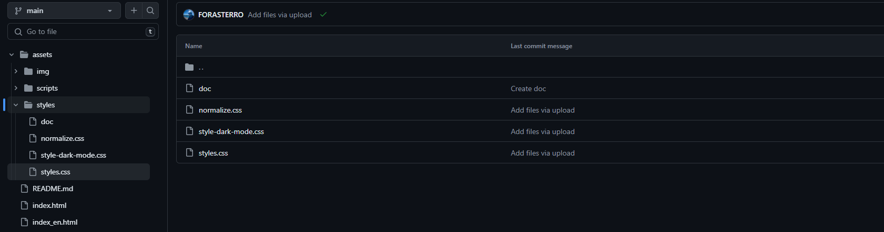

# ***CAPÍTULO V: PRODUCT IMPLEMENTATION, VALIDATION & DEPLOYMENT***
--------
## 5.1. Software Configuration Management
En este apartado se describen las elecciones y reglas que permitirán al equipo asegurar la consistencia a lo largo de todo el proceso de desarrollo de nuestra solución.
### 5.1.1. Software Development Environment Configuration
En esta sección se ofrecen los vínculos a las aplicaciones y productos de software desarrollados durante el ciclo del proyecto utilizando los programas adecuados. 

Con este propósito, se estructurará en las siguientes categorías:

* Project Management
* Requirements Management
* Product UX/UI Design
* Software Development
* Software Testing
* Software Documentation

Además, se categorizarán los elementos de estas secciones como enlaces de referencia (para software basado en modelos Saas) o enlaces de descarga (para productos que se ejecuten en las computadoras de los miembros del equipo) para cada uno de los productos de software.

<body>
    <table>
        <tr>
            <th>PROJECT MANAGEMENT</th>
            <td>Este campo se basa en la gestión de proyectos y tiene como objetivo principal mejorar los procesos y su entorno con el fin de alcanzar los resultados deseados.</td>
        </tr>
        <tr>
            <td colspan="2">Durante el transcurso del proyecto digital, se realizará la implementación de un producto de software basado en el modelo SaaS, el cual operará a través de un navegador web. Sin embargo, no se creará una versión correspondiente de la aplicación móvil.</td>
        </tr>
    </table>
</body>

<body>
    <table>
        <tr>
            <th>REQUIREMENTS MANAGEMENT</th>
            <td>Este procedimiento se centra en garantizar que una empresa registre, compruebe y cumpla con los requisitos y deseos de sus clientes, así como de las partes interesadas internas o externas.</td>
        </tr>
        <tr>
            <td colspan="2"> <strong>Pivotal Tracker:</strong> Esta herramienta se define como una plataforma que simplifica la gestión de las historias de usuario al organizarlas en epopeyas y evaluar su importancia en el programa según su puntuación. Se seleccionó por su capacidad para permitir que cada integrante del equipo comparta una vista en tiempo real del progreso en cada proyecto, colaborando en distintas secciones o ajustando el flujo del proyecto.</td>
        </tr>
    </table>
</body>

|**Product UX/UI Design**|
|-|
|Este software facilita la creación digital de modelos que se integran en la experiencia del consumidor. En nuestro caso, estamos desarrollando un modelo de sitio web compatible tanto con computadoras como con dispositivos móviles.|

Para lograrlo, hemos empleado varias herramientas de diseño y colaboración, entre las que se incluyen:

**1. Uxpressia:** Uxpressia es una plataforma en línea especializada en mapeo de la trayectoria del cliente. Nos ayuda a crear mapas de impacto y perfiles de usuario, como User Personas, Empathy Maps y Journey Maps. Puedes obtener más información sobre Uxpressia en [este enlace](https://uxpressiacom/).                                                      
**2. MIRO:** MIRO es una pizarra digital colaborativa en línea que se adapta a diversas actividades colaborativas, como investigación, ideación, creación de lluvias de ideas y mapas mentales. Es una herramienta versátil que facilita el trabajo en equipo. Descubre más sobre MIRO en [su sitio web](https://miro.com/app/dashboard/).                                                        
**3. Figma:** Figma es una herramienta de prototipado web y un editor de gráficos vectoriales. A diferencia de otras herramientas, Figma se ejecuta en línea, lo que permite crear modelos que funcionan tanto en navegadores web como en navegadores móviles. Puedes explorar Figma en [este enlace](https://www.figma.com/design/).                                                    
**4. Lucid Chart:** Esta es una aplicación de diagramación en línea que permite a los usuarios colaborar y trabajar juntos en tiempo real para crear una variedad de diseños, incluidos diagramas UML, mapas mentales, prototipos de software y otros tipos de diagramas. Puedes conocer más acerca de Lucid Chart en [este enlace](https://lucid.app/lucidchart/).                                            
**5. Overflow:** Overflow es una herramienta de diagramación que ofrece la posibilidad de colaborar en tiempo real. Utilizamos esta herramienta para crear diagramas de Userflows. Si deseas obtener más información sobre Overflow, visita [su sitio web](https://userflow.com/app/).                                                

Estas herramientas nos ayudan a dar vida a nuestros diseños digitales y a asegurar que nuestros productos sean accesibles y atractivos en diversas plataformas.

- **Software Development:** El desarrollo de software es una estrategia empleada en la elaboración de productos de software. Esta técnica se emplea para establecer un método que dirige el desarrollo del software, y cada etapa describe un enfoque particular para las diversas actividades que tienen lugar durante el proceso.

A continuación, te mostramos algunas herramientas y tecnologías esenciales que emplearemos en el proyecto:

**1. GitHub:** GitHub es una plataforma de repositorio colaborativo utilizada para almacenar y gestionar el progreso de proyectos realizados por grupos de personas. Puedes acceder al repositorio del proyecto en [este enlace](https://github.com/OpenSource-Grupo4).                                                                  
**2. Webstorm:** Webstorm es un entorno de desarrollo de JetBrains, una compañía especializada en software, diseñado para el desarrollo web en JavaScript. Esta herramienta ofrece facilidades para probar sitios web en navegadores como Google Chrome. En nuestro proyecto, usaremos WebStorm para trabajar con lenguajes como HTML, CSS y JavaScript. Obtén más información sobre WebStorm [aquí](https://www.jetbrains.com/webstorm/).          
**3. HTML:** HTML es un lenguaje de marcado utilizado en el desarrollo de sitios web para crear hipertextos y enlazar a otros documentos. Proporciona herramientas para diseñar sitios web y se puede combinar eficazmente con CSS y JavaScript. En nuestro proyecto, utilizaremos HTML para implementar la estructura de la página web. Obtén más información sobre la edición de archivos HTML en WebStorm [aquí](https://www.jetbrains.com/help/idea/editing-html-files.html).                                                          
**4. CSS:** CSS es un lenguaje de estilo para la web que permite mejorar la interfaz de usuario añadiendo elementos como colores y tamaños, entre otros. También es posible crear un estilo en CSS y aplicarlo al sitio web creado en HTML. Este lenguaje será utilizado en la implementación del diseño de nuestra plataforma web. Puedes obtener más información sobre CSS [aquí](https://www.jetbrains.com/help/idea/style-sheets.html).             
**5. JavaScript:** JavaScript es un lenguaje de programación interpretado que funciona bajo el paradigma de programación orientada a objetos (POO), utilizando prototipos en lugar de clases para la implementación. Permite crear dinámicas para los usuarios a través de la lógica de programación y será utilizado en la creación de interacciones dinámicas en la plataforma web. Encuentra más detalles sobre JavaScript [aquí](https://www.jetbrains.com/help/idea/javascript-specific-guidelines.html).   

Estas herramientas y tecnologías serán esenciales para el desarrollo exitoso de nuestro producto de software.

- **Software Testing:** Esto implica examinar los componentes y el rendimiento del software bajo prueba a través de procesos de validación y verificación.
- **Lenguaje Gherkin:** Este tipo de lenguaje, denominado DSL (Lenguaje Específico de Dominio), se crea con el propósito específico de resolver problemas particulares. Además de ser convertible en código, permite incorporar historias de usuario del programa junto con sus componentes asociados, como Característica, Escenario, Ejemplo, Esquema de Escenario, Dado, Cuando, Entonces y Y.
- **Software Documentation:** Se trata de los textos escritos o ilustraciones que acompañan al software de computadora o se integran en su código fuente. Esta documentación tiene como objetivo explicar cómo funciona el software o cómo utilizarlo.

### 5.1.2. Source Code Management
A continuación, se detalla la gestión del código fuente, también conocida como SCM (Source Code Management) por sus siglas en inglés. Su principal función es seguir las modificaciones que el equipo realizará durante el desarrollo de los proyectos en los repositorios de código fuente. Se utilizará como un sistema de control de versiones que permite rastrear los cambios efectuados por cada miembro o desarrollador en el proyecto. Es importante destacar que utilizaremos **GitHub** como nuestro sistema de control de versiones.
|**`LINK'S DIRECTOS`**|
|-|
|**URL de la organización:** [Grupo 4](https://github.com/OpenSource-Grupo4) - *https://github.com/OpenSource-Grupo4*|
|**URL del repositorio del Project-Report :** [Grupo 4](https://github.com/OpenSource-Grupo4/Project-Report-2) - *https://github.com/OpenSource-Grupo4/Project-Report-2*|
|**URL del repositorio de Landing Page:** [LandingPage](https://github.com/OpenSource-Grupo4/LandingPageTechHelpG4.github.io) - *https://github.com/OpenSource-Grupo4/LandingPageTechHelpG4.github.io*|
|**URL del repositorio del FrontEnd:** [FrontEnd](https://github.com/OpenSource-Grupo4/techelp-frontend) - *https://github.com/OpenSource-Grupo4/techelp-frontend*|
|**URL del repositorio del BackEnd:** [BackEnd](https://github.com/OpenSource-Grupo4/techhelp-backend) - *https://github.com/OpenSource-Grupo4/techhelp-backend*|
### 5.1.3. Source Code Style Guide & Conventions
En esta sección, se presentarán las pautas, convenciones, estilos y principios que se aplicarán a cada uno de los lenguajes utilizados en la creación de nuestra aplicación. La observancia de este conjunto de directrices reviste una importancia fundamental, ya que tiene el propósito de mantener la calidad estructural del software, mejorar la legibilidad del código fuente y simplificar el mantenimiento del mismo.

Dado que en este proyecto se emplearán varios lenguajes, como HTML, CSS, JavaScript, Java y TypeScript para el desarrollo de la plataforma web, así como Gherkin para el proceso de pruebas del programa, a continuación, se detallarán y describirán las reglas y recomendaciones generales que se tendrán en cuenta al utilizarlos.

|**`DATOS`**|
|-|
|**Nomenclatura General:** Para los nombres de variables, objetos, elementos y funciones que se utilicen en el proyecto, se emplearán términos en inglés que estén relacionados con lo que representan. No se utilizarán mayúsculas en estos nombres, ya que, de acuerdo con W3Schools (sin fecha), la combinación de mayúsculas y minúsculas puede dificultar la legibilidad del código. En su lugar, se optará por utilizar exclusivamente letras minúsculas, lo que contribuirá a una mayor claridad en el código.|
||
||
|**Sangría:** Cuando se trabaje con HTML, CSS y/o JavaScript, se aplicará un espaciado de dos espacios antes de cada línea que se encuentre dentro de un bloque. Según W3Schools (sin fecha), no se recomienda el uso de la tecla "Tabulación". A continuación, se muestra un ejemplo de la sangría estándar en HTML siguiendo las directrices de W3Schools (s.f.):|
||
|Ejemplo de formato estándar de sangría en CSS, conforme a las recomendaciones de W3Schools (s.f):|
||
|Ejemplo de nomenclatura estándar de la sangría en JavaScript según W3School (s.f.):|
||

- **Especificaciones generales:** A continuación, detallaremos las reglas específicas necesarias para comprender el código de nuestra aplicación en cada lenguaje.

|**`HTML`**|
|-|
|HTML, acrónimo de HyperText Markup Language en inglés, es un lenguaje de marcado que se utiliza para definir la estructura de una página web. También incluye funcionalidades que permiten controlar el comportamiento de diferentes elementos del contenido de la página, como cambiar el tamaño del texto o aplicar formato cursiva, entre otros. En nuestro proyecto, emplearemos HTML5, y a continuación, se presentan las características y directrices que debemos seguir para utilizar este lenguaje de la siguiente manera:|
||
|**Blank Lines:** Cada vez que comiences un nuevo bloque, lista o tabla de gran longitud, es recomendable dejar una línea en blanco después del elemento anterior para mejorar la legibilidad y la presentación del código, de acuerdo con las pautas de W3Schools (s.f.):|
||
|**Quote attribute Values:** Para los valores de los atributos, es común utilizar comillas dobles alrededor de ellos, aunque esta característica no sea obligatoria. Según W3Schools (sin fecha), esto mejora la legibilidad del código y es una práctica común entre los desarrolladores. Aquí tienes un ejemplo:|
||
|**Never Skip the \<title> Element:** El elemento `<title>` permite que las páginas aparezcan en la lista de resultados al realizar búsquedas en un navegador web. Además, este elemento es responsable de proporcionar el nombre de la página cuando se agrega a marcadores o favoritos. A continuación, se muestra un ejemplo de su uso:|
||
|**HTML Line-Wrapping:** A pesar de que en un documento HTML no exista un límite estricto en la cantidad de palabras por línea, no se recomienda generar líneas de código excesivamente largas. De hecho, hacerlo dificulta la legibilidad del código. Para continuar en la siguiente línea, se deben utilizar al menos cuatro espacios para distinguir elementos secundarios. Aquí tienes un ejemplo basado en las recomendaciones de Google (sin fecha):|
||

|**`CSS`**|
|-|
|CSS, conocido por sus siglas en inglés, Cascading Style Sheets (Hojas de Estilo en Cascada), es un lenguaje que se enfoca en definir y mejorar la presentación de un documento basado en HTML. A continuación, se presentan las directrices que debemos seguir al utilizar CSS:|
||
|**Shorthand Properties:** Se recomienda utilizar abreviaturas de propiedades y declarar los campos de los elementos en la menor cantidad de líneas posible, según las pautas de Google (sin fecha). Esto aumenta la eficiencia del código y lo hace más legible. Además, se debe evitar agregar unidades después del valor cero. Aquí tienes un ejemplo:|
||
|**Declaration Stops:** Es importante incluir un punto y coma al final de cada declaración en CSS, al igual que en la mayoría de los lenguajes de programación. Siguiendo las pautas de Google (sin fecha), esta práctica contribuye a mantener la coherencia en el código. A continuación, se muestra un ejemplo:|
||
|**Property Name Stops:** Es necesario incluir un espacio entre los dos puntos que siguen al nombre de una propiedad y el valor correspondiente. Siempre se debe colocar un solo espacio después de los dos puntos, pero no antes. A continuación, se muestra un ejemplo siguiendo esta convención estándar de Google (s.f):|
||
|**Declaration Block Separation:** Es esencial utilizar un espacio separador después del nombre de un selector de elemento y antes de la llave que inicia un bloque de declaración CSS. Además, la llave de apertura del bloque debe estar en la misma línea que el selector. Aquí tienes un ejemplo siguiendo esta convención estándar de Google (sin fecha):|
||
|* **CSS quotation Marks:** No se deben utilizar comillas dobles (`"`) en el código CSS; en su lugar, se permiten y deben emplearse comillas simples (`'`) únicamente para selectores de atributos y valores de propiedades. Ejemplo conforme a las pautas estándar de Google (sin fecha):|
||

|**`JAVASCRIPT`**|
|-|
|JavaScript es un lenguaje de programación que permite especificar de manera precisa las acciones que debe realizar el navegador web, incluyendo el orden de ejecución de tareas y la frecuencia con la que se deben llevar a cabo. A continuación, se presentan las pautas para el uso de JavaScript en nuestro proyecto:|
||
|**Spaces around operators:** Es importante añadir espacios alrededor de cada operador matemático y comas que se utilicen en el código JavaScript. A continuación, se muestra un ejemplo siguiendo la convención estándar de W3Schools (sin fecha):|
||
|**Simple Statement's End:** Es fundamental que una instrucción simple finalice con un punto y coma, tal como es el caso en muchos otros lenguajes de programación. A continuación, se muestra un ejemplo que cumple con la convención estándar de W3Schools (sin fecha):|
||
|**Beginning and End of Function:**
Un bloque de función debe incluir una llave al final de la primera línea, de modo que el cierre de la función esté en la última línea, sin necesidad de un punto y coma. Este mismo principio se aplica a las estructuras condicionales y los bucles. A continuación, se muestra un ejemplo que cumple con la convención estándar de W3Schools (sin fecha):|
||
|**Object Rules:** Para la creación de un objeto, al igual que en una función, se comienza con una llave al final de la primera línea. Sin embargo, en este caso, la llave de cierre debe ir seguida de un punto y coma. Para definir las propiedades del objeto, se utilizan dos puntos y un espacio para separar el nombre de la propiedad de su valor. Si el valor es un string, se debe encerrar entre comillas dobles. A continuación, se muestra un ejemplo siguiendo la convención estándar de W3Schools (sin fecha):|
||

|**`GHERKING`**|
|-|
|Gherkin es un Lenguaje Específico de Dominio (DSL por sus siglas en inglés) que se utiliza para resolver problemas específicos mediante la generación de casos de prueba que validan una característica en diversos escenarios. Gherkin incluye varios elementos, entre los cuales los más conocidos y utilizados son Feature, Scenario, Example, Given, When y Then. A continuación, se presentan las pautas que debemos seguir al utilizar Gherkin en nuestro código:|
||
|**Discernible Given-When-Then Blocks:** Es importante aplicar sangría a los elementos que representan los pasos a seguir en un escenario. En el caso de "And", se debe aplicar una sangría adicional. Siguiendo la recomendación de Keiblinger (2021), este enfoque ayuda a identificar rápidamente las partes que componen un escenario. A continuación, se muestra un ejemplo:|
||
|**Step with Tables:** Conforme a la recomendación de Keiblinger (2021), cuando sea necesario introducir valores en partes del escenario, se debe emplear una tabla o crear un formulario que refleje esa parte del escenario. Antes de esta representación, se deben colocar dos puntos. Aquí tienes un ejemplo:|
||
|**Reducing Noise:** Para evitar la acumulación de demasiadas líneas de código en un escenario, es recomendable incluir valores por defecto dentro de los pasos para campos que no sean muy relevantes para ese escenario en particular. Los valores "estándar" que se coloquen deben estar entre comillas simples. Siguiendo el consejo de Keiblinger (2021), esta práctica contribuye significativamente a la reducción del tamaño del código. A continuación, se muestra un ejemplo:|
||
|**Scenarios Separator:** Para separar dos escenarios, se debe insertar un salto de línea y, según la sugerencia de Keiblinger (2021), si es posible, agregar una línea de comentario para facilitar la visualización de estos. De esta manera, se identifica rápidamente el inicio y el fin de un escenario. A continuación, se presenta un ejemplo:|
||

|**`JAVA`**|
|-|
|Java es una plataforma informática de lenguaje de programación que fue desarrollada por Sun Microsystems en 1995. A lo largo de los años, ha experimentado una evolución significativa y ha desempeñado un papel fundamental en la creación de numerosos servicios y aplicaciones que conforman gran parte del mundo digital actual. A continuación, se presentan las pautas para utilizar Java en nuestro proyecto:|
||
|**Clases e interfaces en Java:** Los nombres de las clases deben ser sustantivos y seguir una convención de mayúsculas y minúsculas, con la primera letra de cada palabra interna en mayúscula. Del mismo modo, los nombres de las interfaces deben comenzar con una letra mayúscula, al igual que los nombres de las clases. Se debe utilizar palabras completas y evitar el uso de acrónimos y abreviaturas. Aquí tienes un ejemplo:|
||
|**Métodos en Java:** Los métodos deben seguir una convención de nombres que utilice verbos y mantenga la combinación de mayúsculas y minúsculas, con la primera letra de cada palabra interna (a partir de la segunda) en mayúscula. A continuación, se presenta un ejemplo:|
||
|**Variables en Java:** Los nombres de las variables deben ser concisos pero significativos, evitando comenzar con un guión bajo (\_) o caracteres especiales como el signo de dólar ($). Deben ser mnemotécnicos, es decir, diseñados de manera que indiquen claramente su propósito a un observador casual. Generalmente, se deben evitar los nombres de una sola letra para las variables, a menos que se utilicen como variables temporales. Los nombres comunes para variables temporales son: i, j, k, m y n para enteros, y c, d y e para caracteres. A continuación, se muestra un ejemplo:|
||
|**Excepciones:** A menos que se justifique en un comentario, es extremadamente raro que sea apropiado no realizar ninguna acción en respuesta a una excepción detectada. En el caso en que no sea necesario realizar ninguna acción en un bloque catch, la razón debe explicarse de manera clara en un comentario. A continuación, se presenta un ejemplo:|
||
|En este ejemplo, se ha incluido un comentario para explicar por qué no se realiza ninguna acción en el bloque catch cuando se detecta una excepción de formato numérico. Esto ayuda a comprender el motivo detrás de esta decisión en el código.
En el contexto de las pruebas, es aceptable ignorar una excepción detectada sin comentarios si su nombre es o comienza con "expected". Esto es un patrón común para verificar que el código bajo prueba arroje una excepción del tipo esperado, por lo que no se requiere un comentario adicional en este caso. A continuación, se muestra un ejemplo:|
|| 

|**`JAVA-SCRIPT`**|
|-|
|JavaScript es uno de los lenguajes más populares y ha experimentado un rápido avance y mejora en los últimos años. A continuación, se presentan las pautas para utilizar JavaScript en nuestro proyecto:|
|En TypeScript, se recomienda que las variables se declaren en minúsculas y se especifique el tipo de dato utilizando dos puntos después del nombre de la variable. Aquí tienes ejemplos de cómo declarar y asignar valores a variables en TypeScript:|
||
### 5.1.4. Software Deployment Configuration
Como mencionamos previamente, la gestión de nuestro código fuente se realizará a través de GitHub. Además, para la publicación y despliegue de la página, aprovecharemos GitHub Pages.

En relación con el desarrollo de la página de inicio de TecHelp, hemos utilizado las siguientes herramientas:

|**`SOFTWARE DEPLOYMENT CONFIGURATION`**|
|-|
|**HTML:** Es el lenguaje de marcado que hemos utilizado para estructurar nuestro Landing Page|
||
||
|**CSS:** Nos ayudó con la parte de diseño de interface para que esta sea interactubale con los visitantes de la Langding Page.|
||
||
|**git:** Git es un sistema de control de versiones diseñado para optimizar la eficiencia y la compatibilidad de versiones. Esta herramienta desempeñó un papel fundamental en nuestra colaboración en equipo durante el desarrollo de la Landing Page.|
||

|**`HERRAMIENTA`**|**`DESCRIPCIÓN`**|**`LOGO`**|
|-----|-----|----|
|**GitHub**|Plataforma de desarrollo colaborativo.||
|**Git Flow**|Nos permitió controlar el avance de cada uno de nuestros integrantes con respecto al desarrollo del Landing Page.||
|**Git Hub Pages**|Servicio de Github que nos permitió alojar nuestra lading page.||
## 5.2. Landing Page, Services & Applications Implementation
En esta sección se describe el proceso seguido para la implementación, pruebas, documentación y despliegue de los componentes del proyecto: Landing Page, Web Services y Frontend Web Applications. El desarrollo se llevó a cabo siguiendo una metodología ágil, con iteraciones estructuradas en Sprints. A continuación, se presenta el desglose de actividades por Sprint.
### 5.2.1. Sprint 1
En la fase inicial de nuestro proyecto, nos propusimos llevar a cabo la implementación del diseño de nuestra Landing Page utilizando WebStorm como entorno de desarrollo. Esto implica que al concluir el Sprint, todas las secciones, ya sea Home, Services, Pricing, Testimonials o About Us, deben estar completadas.
#### 5.2.1.1. Sprint Planning 1
<table>
    <thead>
        <tr>
            <th>Sprint #</th>
            <th>Sprint 1</th>
        </tr>
    </thead>
    <tbody>
        <tr>
            <td colspan="2"><b>Sprint Planning Background</b></td>
        </tr>
        <tr>
            <td>Date</td>
            <td>2024/04/30</td>
        </tr>
        <tr>
            <td>Time</td>
            <td>11:00 PM</td>
        </tr>
        <tr>
            <td>Location</td>
            <td>Discord meeting</td>
        </tr>
        <tr>
            <td>Prepared by</td>
            <td>Raúl Quispe</td>
        </tr>
        <tr>
            <td>Atendees (to planning meeting)</td>
            <td>
                Manuel, Santiago, Gonzalo 
            </td>
        </tr>
        <tr>
            <td>Sprint 1 Review Summary</td>
            <td>
                Las partes interesadas y el propietario del producto estaban satisfechos con el progreso alcanzado al finalizar el tercer sprint, tal como se esperaba.
            </td>
        </tr>
        <tr>
            <td>Sprint 1 Retrospective Summary</td>
            <td>
                La primera versión de la página de aterrizaje se ha implementado, aunque presenta algunas deficiencias en términos de diseño y facilidad de uso. 
            </td>
        </tr>
        <tr>
            <td colspan="2"><b>Sprint Goal & User Stories</b></td>
        </tr>
        <tr>
            <td>Sprint 1 Goal</td>
            <td>
                Finalizar y mejorar las interfaces y secciones del landing page.
            </td>
        </tr>
        <tr>
            <td>Sprint 1 Velocity</td>
            <td>
                30
            </td>
        </tr>
        <tr>
            <td>Sum of story points</td>
            <td>
                29
            </td>
        </tr>
    </tbody>
</table>
#### 5.2.1.2. Sprint Backlog 1
<table>
  <tr>
    <td> <strong>Sprint #</strong></td>
    <td align="center" colspan="7"> <strong>Sprint 1</strong> </td>
  </tr>

   <tr>
    <td align="center" colspan="2"> <strong>User Story</strong></td>
    <td align="center" colspan="6"> <strong>Work-item/Task</strong></td>
  </tr>
  <tr>
    <td align="center"> <strong>ID</strong> </td>
    <td align="center"> <strong>Title<strong></td>
    <td align="center"> <strong>ID</strong> </td>
    <td align="center"> <strong>Title<strong></td>
    <td align="center"> <strong>Description<strong></td>
    <td align="center"> <strong>Estimation (Hours)<strong></td>
    <td align="center"> <strong>Assigned To<strong></td>
    <td align="center"> <strong> Status (To-do/In-Process/To-Review/Done)  <strong></td>
  </tr>
  <!---------------------------------------------------------------------- -->
  <tr>
    <td rowspan="4" align="center"> ID </td>
    <td rowspan="4" align="center"> US1: Navegar libremente por la Landing Page </td>
    <td align="center"> TA01 </td>
    <td align="center"> Añadir lista de etiquetas</td>
    <td align="justify"> Se añadirán las etiquetas de home, services, membreship, contac-us, about-us.</td>
    <td align="center"> 1 </td>
    <td align="center"> Raúl Ronaldo Quispe Erasmo</td>
    <td align="center">Done</td>
  </tr>

  <tr>
    <td align="center"> TA02 </td>
    <td align="center"> Vincular las secciones </td>
    <td align="center"> se determina la esturctura e IDs de las secciones y se vincula las etiquetas a estas para luego comenzar a codificar estas</td>
    <td align="center"> 1</td>
    <td align="center"> Raúl Ronaldo Quispe Erasmo</td>
    <td align="center">Done</td>
  </tr>

  <tr>
    <td align="center"> TA03 </td>
    <td align="center"> Añadir Logo y estilos del nav</td>
    <td align="center"> Se añede el logo de la solución planteada y se implementa los estilos del toolbar </td>
    <td align="center"> 3</td>
    <td align="center"> Raúl Ronaldo Quispe Erasmo</td>
    <td align="center">Done</td>
  </tr>

  <tr>
    <td align="center"> TA04 </td>
    <td align="center"> Añadir botones de modo oscuro e idioma.</td>
    <td align="center"> Se añeden los botones de cambio de idioma y boton de modo oscuro para hacerlo mas agaradable al posible usuario</td>
    <td align="center"> 2</td>
    <td align="center"> Raúl Ronaldo Quispe Erasmo</td>
    <td align="center">Done</td>
  </tr>

  <tr>
    <td rowspan="3" align="center"> ID </td>
    <td rowspan="3" align="center"> US2: Apartado de contacto con el Startup</td>
    <td align="center"> TA01 </td>
    <td align="center"> Añadir título y descripción</td>
    <td align="justify"> Se añadirá el tiítulo correspodniente a la sección a realizar y redactar una oración inivitando a las personas a escribirnos</td>
    <td align="center"> 2</td>
    <td align="center"> Manuel Alexis Vargas Quispe</td>
    <td align="center"> Done</td>
  </tr>

  <tr>
    <td align="center"> TA02 </td>
    <td align="center"> Añadir formulario</td>
    <td align="justify"> Se añadirá un formulario donde los usuarios objetivos deben ingresas sus nombres, medio de contacto y una descripción sobre la duda que tienen</td>
    <td align="center"> 1</td>
    <td align="center"> Manuel Alexis Vargas Quispe</td>
    <td align="center"> Done</td>
  </tr>

  <tr>
    <td align="center"> TA03 </td>
    <td align="center"> Añadir botón de enviar, imagen y estilos</td>
    <td align="justify"> Se añadirá una imagen llamativa sobre lo que ofrece nuestro software, se implementará un botón para enviar el contenido del formulario y se agregarán los estilos correspondientes. </td>
    <td align="center"> 3 </td>
    <td align="center"> Manuel Alexis Vargas Quispe</td>
    <td align="center"> Done</td>
  </tr>

  <tr>
    <td rowspan="2" align="center"> ID </td>
    <td rowspan="2" align="center"> US3: Beneficios de la aplicación</td>
    <td align="center"> TA01 </td>
    <td align="center"> Se añadirá el titulo y descripción de la sección</td>
    <td align="center"> Se añadirá una pregunta a modo de título (¿Por qué TecHelp?), descripciónes incitando a que usen nuestra solucón y lo que ofrece para cada tipo de posible usuario</td>
    <td align="center"> 1</td>
    <td align="center"> Santiago Olivera Guerra</td>
    <td align="center"> Done</td>
  </tr>

  <tr>
    <td align="center"> TA02 </td>
    <td align="center"> Organizar las beneficios en dos card</td>
    <td align="center"> Se organizará el contenido de la seccion de beneficios mediante cards para cada segmento objetivo</td>
    <td align="center"> 2</td>
    <td align="center"> Santiago Olivera Guerra</td>
    <td align="center"> Done</td>
  </tr>

   <tr>
    <td rowspan="3" align="center"> ID </td>
    <td rowspan="3" align="center"> US4: Mostrar los planes disponibles</td>
    <td align="center"> TA01 </td>
    <td align="center"> Añadir título y decripción</td>
    <td align="center"> Se añade el título a manera de pregunta para captar la atención de nuestros posibles usuarios e invitamos a suscribirce a a nuestros planes </td>
    <td align="center"> 3</td>
    <td align="center"> Gonzalo Andre Zavala Quedena</td>
    <td align="center"> Done</td>
  </tr>

  <tr>
    <td align="center"> TA02 </td>
    <td align="center"> Cards para organizar las membresias</td>
    <td align="center"> Se agregarán cards para organizar la información de las membreisas e invitar a que sean parte de nostros con botones para suscribirse</td>
    <td align="center"> 2</td>
    <td align="center"> Gonzalo Andre Zavala Quedena</td>
    <td align="center"> Done</td>
  </tr>

  <tr>
    <td align="center"> TA03 </td>
    <td align="center"> Botones de suscripciones y estilos de seccion</td>
    <td align="center"> Se añadirán las botones correspondientes a cada tipo de membresia y además se ñadirán los estilos correspondientes para que la sección sea más consistente</td>
    <td align="center"> 2</td>
    <td align="center"> Gonzalo Andre Zavala Quedena</td>
    <td align="center"> Done</td>
  </tr>

   <tr>
    <td rowspan="3" align="center"> ID </td>
    <td rowspan="3" align="center">  US5: Información del startup</td>
    <td align="center"> TA01 </td>
    <td align="center"> Titulo y descripción</td>
    <td align="center"> Se agregará un título para diferenciar la sección y los estilos corresponidentes para distinguir una sección de la otra.</td>
    <td align="center"> 1</td>
    <td align="center"> Manuel Alexis Vargas Quispe</td>
    <td align="center"> Done</td>
  </tr>

  <tr>
    <td align="center"> TA02 </td>
    <td align="center"> Descripción de integrantes</td>
    <td align="center"> Se agregará una descripción breve de los integrante del equipo que se está dedicando al proceso de desarrollo de la solución </td>
    <td align="center"> 2</td>
    <td align="center"> Raúl Ronaldo Quispe Erasmo</td>
    <td align="center"> Done</td>
  </tr>

  <tr>
    <td align="center"> TA03 </td>
    <td align="center"> Organizar el contenido en cards</td>
    <td align="center"> Se agregarán los estilos correspondientes para separar cada integrante en cards para tener una mejor organización y cisualización de las mismas</td>
    <td align="center"> 3</td>
    <td align="center"> Gonzalo Andre Zavala Quedena</td>
    <td align="center"> Done</td>
  </tr>
</table>
#### 5.2.1.3. Development Evidence for Sprint Review
<table>
  <tr>
    <td align ="center" > <strong>Repository</strong></td>
    <td  align ="center" > <strong>Branch</strong></td>
    <td  align ="center" > <strong>Commit ID</strong></td>
    <td  align ="center" > <strong>Commit message</strong></td>
    <td  align ="center" > <strong>Commit Masagge body</strong></td>
    <td  align ="center" > <strong>Commit on (date)</strong></td>
  </tr>

  <tr>
    <td rowspan="16" align="center"> https://github.com/OpenSource-Grupo4/LandingPageTechHelpG4.github.io </td>
    <td align="center"> main</td>
    <td align="center"> 03ba6df</td>
    <td align="center"> ---</td>
    <td align="center"> ---</td>
    <td align="center"> 18/05/2024</td>
  </tr>
  
  <tr>
    <td align="center"> Feature </td>
    <td align="center"> ebc15fe</td>
    <td align="center"> Feat: Update index.html</td>
    <td align="center"> ---</td>
    <td align="center"> 18/05/2024</td>
  </tr>

  <tr>
    <td align="center"> developer</td>
    <td align="center"> 434dd58</td>
    <td align="center"> Feat: developer to main</td>
    <td align="center"> ---</td>
    <td align="center"> 18/05/2024</td>
  </tr>

</table>
#### 5.2.1.4. Testing Suite Evidence for Sprint Review
En el Sprint 1, se completaron únicamente las características relacionadas con el sitio web estático, sin que se llevara a cabo la implementación de los Web Services.
#### 5.2.1.5. Execution Evidence for Sprint Review
A continuación, presentamos capturas de pantalla que muestran el progreso deL Landing Page:

En la parte superior, encontramos el encabezado (Header), que incluye botones de inicio (Home), servicios (Service), membresías (Membership), contacto (Contact-Us), información sobre nosotros (About Us), un selector de idioma (inglés y español) y un botón para activar el modo oscuro. Estos elementos permiten a los visitantes navegar fácilmente a la sección que deseen visualizar.

|**`IMÁGENES`**|
|-|
|**`IMAGEN 1: ENCABEZADO Y BOTONES DE DESPLAZAMIENTO`**|
|Se muestra la sección "Hero", que cuenta con una breve descripción y una frase representativa de TecHelp. Esta sección también facilita el inicio del uso del servicio web y presenta una imagen relacionada con el mismo.|
||
||
|**`IMAGEN 2: SECCIÓN HERO`**|
|Se presenta la sección de beneficios del servicio para cada segmento objetivo identificado por el equipo.|
||
||
|**`IMAGEN 3: SECCIÓN BENEFITS Ó SERVICE`**|
|Se exhibe la sección de membership en la página de aterrizaje, donde los potenciales usuarios pueden visualizar los diferentes tipos de membresías y sus respectivos costos.|
||
|**`IMAGEN 4: SECCIÓN MEMBERSHIP`**|
|A continuación, se muestra la sección de contacto, donde nuestros posibles usuarios pueden realizar preguntas personalizadas sobre la aplicación que estamos presentando.|
||
|**`IMAGEN 5: SECCIÓN CONTACT-US`**|
|Luego, se muestra la sección "Sobre nosotros" (About Us). En esta sección, se proporciona un resumen informativo sobre las personas que están desarrollando la solución de software.|
||
|**`IMAGEN 6: SECCIÓN ABOUT-US`**|
|Finalmente, se presenta la sección del pie de página, que incluye nuestros enlaces a redes sociales y botones que permiten al usuario regresar fácilmente a las secciones deseadas.|
||
|**`IMAGEN 7: SECCIÓN FOOTER`**|
||
#### 5.2.1.6. Services Documentation Evidence for Sprint Review
En el primer sprint, hemos diseñado, programado y puesto en funcionamiento la página de inicio para presentar la aplicación web "Techelp". En esta página de inicio, encontrarás varias secciones creadas para nuestro Landing Page.

|**`REPOSITORIO LANDING PAGE`**|>|[https://github.com/OpenSource-Grupo4/LandingPage-Grupo4](https://github.com/OpenSource-Grupo4/LandingPageTechHelpG4.github.io)|
|-----|----|----|
#### 5.2.1.7. Software Deployment Evidence for Sprint Review
Para la implementación de nuestra página, optamos por utilizar GitHub Pages. En este proceso, creamos un repositorio en GitHub donde gestionamos el control de versiones. En la sección de Configuración, publicamos el proyecto almacenado en la rama "main" que previamente se encontrba en la rama release-1.0.

|**`LANDING PAGE DESPLEGADO`**|>|https://opensource-grupo4.github.io/LandingPageTechHelpG4.github.io/|
|-----|----|----|
#### 5.2.1.8. Team Collaboration Insights during Sprint
En esta entrega, nuestra meta principal fue la implementación de la Landing Page. Para llevar a cabo este objetivo, hicimos uso de diversas herramientas como GitHub, Visual Studio Code, WebStorm, HTML, CSS y JavaScript. A continuación, vamos a presentar los diagramas de flujo que representan los commits realizados:

--------------
### 5.2.2. Sprint 2
En el segundo sprint, empezamos a construir nuestra aplicación web avanzando con las tareas definidas en las historias de usuario, siguiendo el orden establecido en la lista de pendientes del producto. La suma total de puntos asignados a estas historias de usuario es de 21.

|**FrontEnd Repository:** https://github.com/OpenSource-Grupo4/techelp-frontend|
|-----|
|**FrontEnd Deployed:** https://techelp-front.web.app/login|
||
#### 5.2.2.1. Sprint Planning 2
<table>
    <thead>
        <tr>
            <th>Sprint #</th>
            <th>Sprint 2</th>
        </tr>
    </thead>
    <tbody>
        <tr>
            <td colspan="2"><b>Sprint Planning Background</b></td>
        </tr>
        <tr>
            <td>Date</td>
            <td>2024/05/01</td>
        </tr>
        <tr>
            <td>Time</td>
            <td>11:00 AM</td>
        </tr>
        <tr>
            <td>Location</td>
            <td>Discord meeting</td>
        </tr>
        <tr>
            <td>Prepared by</td>
            <td>Santiago Olivera</td>
        </tr>
        <tr>
            <td>Atendees (to planning meeting)</td>
            <td>
                Raul Quispe, Alexis Vargas, Lorenzo Navarro
            </td>
        </tr>
        <tr>
            <td>Sprint 2 Review Summary</td>
            <td>
                La opinion del product owner y las partes interesadas con respecto al avance realizado al concluir el sprint 3  fue el esperado.
            </td>
        </tr>
        <tr>
            <td>Sprint 4 Retrospective Summary</td>
            <td>
                En el sprint 2 se pudo mejorar aspectos de eficiencia en algunos componentes y la organización de la arquitectura del front-end de la aplicación web 
            </td>
        </tr>
        <tr>
            <td colspan="2"><b>Sprint Goal & User Stories</b></td>
        </tr>
        <tr>
            <td>Sprint 2 Goal</td>
            <td>
                Concluir y mejorar las intefaces de la aplicación web, levantado las observaciones del sprint 3. Implementar las tablas para membreship y la capa de seguridad. 
            </td>
        </tr>
        <tr>
            <td>Sprint 2 Velocity</td>
            <td>
                30
            </td>
        </tr>
        <tr>
            <td>Sum of story points</td>
            <td>
                29
            </td>
        </tr>
    </tbody>
</table>

#### 5.2.2.2. Sprint Backlog 2
<table>
  <tr>
    <td> <strong>Sprint #</strong></td>
    <td align="center" colspan="7"> <strong>Sprint 2</strong> </td>
  </tr>

   <tr>
    <td align="center" colspan="2"> <strong>User Story</strong></td>
    <td align="center" colspan="6"> <strong>Work-item/Task</strong></td>
  </tr>
  <tr>
    <td align="center"> <strong>ID</strong> </td>
    <td align="center"> <strong>Title<strong></td>
    <td align="center"> <strong>ID</strong> </td>
    <td align="center"> <strong>Title<strong></td>
    <td align="center"> <strong>Description<strong></td>
    <td align="center"> <strong>Estimation (Hours)<strong></td>
    <td align="center"> <strong>Assigned To<strong></td>
    <td align="center"> <strong> Status (To-do/In-Process/To-Review/Done)  <strong></td>
  </tr>
  <!---------------------------------------------------------------------- -->
  <tr>
    <td rowspan="4" align="center"> ID </td>
    <td rowspan="4" align="center"> US12	Visualiza  perfil </td>
    <td align="center"> TA01 </td>
    <td align="center"> Realizar componente del perfil del técnico</td>
    <td align="justify"> Se define la estructura o template del componente y los estilos para tener similitud con el prototipo.</td>
    <td align="center"> 3 </td>
    <td align="center"> Alexis Vargas</td>
    <td align="center">Done</td>
  </tr>

  <tr>
    <td align="center"> TA02 </td>
    <td align="center"> Obtener técnico por id </td>
    <td align="center"> Se desarrollará una funcionalidad para obtener el objeto que coincida con el id del técnico seleccionado por el usuario.</td>
    <td align="center"> 1</td>
    <td align="center"> Santiago Olivera</td>
    <td align="center">Done</td>
  </tr>

  <tr>
    <td align="center"> TA03 </td>
    <td align="center"> Rutas de acceso</td>
    <td align="center"> Se definen las rutas de acceso desde el componente Búsqueda de técnicos </td>
    <td align="center"> 1</td>
    <td align="center"> Raul Quispe</td>
    <td align="center">Done</td>
  </tr>

  <tr>
    <td align="center"> TA04 </td>
    <td align="center"> Rutas de salida.</td>
    <td align="center"> Se define las rutas de salida hacia el request de los datos del cliente y agendar una solicitud de reparación.</td>
    <td align="center"> 1</td>
    <td align="center"> Gonzalo Zavala</td>
    <td align="center">Done</td>
  </tr>

  <tr>
    <td rowspan="3" align="center"> ID </td>
    <td rowspan="3" align="center"> US10	Buqueda de tecnicos</td>
    <td align="center"> TA01 </td>
    <td align="center"> Definir componente para la búsqueda de técnicos</td>
    <td align="justify"> Se definirá el template del componente y los estilos que requiera para tener similitud con el mock up</td>
    <td align="center"> 4</td>
    <td align="center"> Gonzalo Saldaña</td>
    <td align="center"> Done</td>
  </tr>

  <tr>
    <td align="center"> TA02 </td>
    <td align="center"> Implementar servicio para datos de los técnicos</td>
    <td align="justify"> Se desarrolla un servicio que implementa un Fake Api para mostrar la información de los técnicos, tal como nombre, calificación, y la foto del mismo.</td>
    <td align="center"> 2</td>
    <td align="center"> Santiago Olivera</td>
    <td align="center"> Done</td>
  </tr>

  <tr>
    <td align="center"> TA03 </td>
    <td align="center"> Definir rutas para acceder al componente Búsqueda de técnicos</td>
    <td align="justify"> Se define una ruta para el componente búsque de técnicos desde el componente principal Home. Así mismo se defina un link de ruta para el componente del perfil del técnico.</td>
    <td align="center"> 1 </td>
    <td align="center"> Santiago Olivera</td>
    <td align="center"> Done</td>
  </tr>

  <tr>
    <td rowspan="4" align="center"> ID </td>
    <td rowspan="4" align="center"> US02	Solicitar reparación de celular</td>
    <td align="center"> TA01 </td>
    <td align="center">Implementar Label </td>
    <td align="center"> Se implementa en angular CLI el codigo en htlm para cada label definido con anterioridad.</td>
    <td align="center"> 1</td>
    <td align="center"> Alexis Vargas</td>
    <td align="center"> Done</td>
  </tr>

  <tr>
    <td align="center"> TA02 </td>
    <td align="center"> Validacion de Label</td>
    <td align="center"> Se valida cada label en el apartado de components.ts</td>
    <td align="center"> 1</td>
    <td align="center"> Raúl Quispe</td>
    <td align="center"> Done</td>
  </tr>
 
  <tr>
    <td align="center"> TA03 </td>
    <td align="center"> Implementacion de Css</td>
    <td align="center"> En el apartado css del componente request se implementa el diseño de los labels</td>
    <td align="center"> 1</td>
    <td align="center"> Alexis Vargas</td>
    <td align="center"> Done</td>
  </tr>

  <tr>
    <td align="center"> TA04 </td>
    <td align="center"> Implementacion de ruta a home</td>
    <td align="center">En el apartado routing realizo las rutas necesarias para conectar las paginas  </td>
    <td align="center"> 2</td>
    <td align="center"> Raúl Quispe</td>
    <td align="center"> Done</td>
  </tr>
</table>

#### 5.2.2.3. Development Evidence for Sprint Review
Se crearon 4 brands: Main, Development, Feature y Feature 2. En el Developer branch es donde convergen los cambios hechos en el Feature , que van desde cambios pequeños a cambios más profundos como la eliminación de componentes repetidos de la entrega anterior, asi mismo, se agrego Angular Material en los Formularios que no contaban con este. 

<table>
  <tr>
    <td align ="center" > <strong>Repository</strong></td>
    <td  align ="center" > <strong>Branch</strong></td>
    <td  align ="center" > <strong>Commit ID</strong></td>
    <td  align ="center" > <strong>Commit message</strong></td>
    <td  align ="center" > <strong>Commit Masagge body</strong></td>
    <td  align ="center" > <strong>Commit on (date)</strong></td>
  </tr>

  <tr>
    <td rowspan="27" align="center"> https://github.com/OpenSource-Grupo4/techelp-frontend </td>
    <td align="center"> main</td>
    <td align="center"> id commit</td>
    <td align="center"> chore: initial commit</td>
    <td align="center"> ---</td>
    <td align="center"> 01/05/2024</td>
  </tr>

</table>

#### 5.2.2.4. Testing Suite Evidence for Sprint Review
Una vez finalizado el sprint 2, conseguimos desarrollar y poner en funcionamiento la sección de búsqueda de servicios técnicos, así como la visualización del perfil de un centro técnico y la capacidad de solicitar servicio de reparación para teléfonos móviles.

|**`EVIDENCIAS`**|
|-|
|**NOMBRE DE LA SECCIÓN**|
|Home - Se presenta la sección "Home", que incluye el navbar con el cual el usuario puede navegar por la pagina.|
||
||
|Visualizar perfil - Se presenta la sección donde el usuario puede visualizar el perfil del tecnico con una reseña y su ubicación.|
||
||
|Solicitar servicio - Se presanta la opcion  la cual el cliente puede solicitar el servicio a un tecnico y rellenar la información pedida de la peticion.|
||

#### 5.2.2.5. Execution Evidence for Sprint Review

#### 5.2.2.6. Services Documentation Evidence for Sprint Review
Durante el segundo sprint, hemos concebido, codificado y activado la página inicial para presentar la aplicación web "Techelp". En esta página inicial, se han integrado varias secciones elaboradas por el equipo, asignando a cada miembro del grupo la responsabilidad de una sección específica.

<table> 
  <tr>
    <td> <strong>End Point </strong></td>
    <td align="center"> <strong>Funciones</strong> </td>
  </tr>
  <tr>
    <td> https://www.npmjs.com/package/json-server</td>
    <td> Fake API  del Frontend de TecHelp</td>
  </tr>
  <tr>
    <td> https://github.com/OpenSource-Grupo4/Fronted </td>
    <td> Desplegar  Frontend de TecHelp</td>
  </tr>
</table>

#### 5.2.2.7. Software Deployment Evidence for Sprint Review
Para llevar a cabo la creación de nuestra página, decidimos emplear Firebase. Durante este proceso, se estableció un proyecto en Firebase y se conectó utilizando Angular Firebase. Para acceder a los datos, se requiere el archivo JSON localmente.
#### 5.2.2.8. Team Collaboration Insights during Sprint
En esta entrega, nos enfocamos principalmente en implementar las funciones de solicitud y visualización de técnicos. Para lograr este objetivo, utilizamos varias herramientas, como GitHub, Visual Studio Code, WebStorm, HTML, CSS y JavaScript. A continuación, vamos a mostrar los diagramas de flujo que representan los commits efectuados por cada integrante del equipo.
### 5.2.3. Sprint 3

#### 5.2.3.1. Sprint Planning 3

En esta etapa, el equipo se propone abordar las observaciones proporcionadas por el propietario del producto y las partes interesadas. Además, se busca completar aproximadamente el 40% del desarrollo del backend de la aplicación web.

<table>
  <tr>
    <td><strong>Sprint #</strong></td>
    <td>Sprint 3</td>
  </tr>

  <tr>
    <td colspan="2"><strong>Sprint Planning Background</strong></td>
  </tr>

  <tr>
    <td><strong>Date</strong></td>
    <td>2023-11-01</td>
  </tr>

  <tr>
    <td><strong>Time</strong></td>
    <td>11:15 AM</td>
  </tr>

  <tr>
    <td><strong>Location</strong></td>
    <td>Reunion realizada en el grupo de discord del equipo de trabajo</td>
  </tr>
  
  <tr>
    <td><strong>Prepared By</strong></td>
    <td>Manuel Alexis Vargas Quispe <b>(Lider de grupo)</b></td>
  </tr>

  <tr>
    <td><strong>Attendees (to planning meeting)</strong></td>
    <td>
      <ol type="A">
        <li>Santiago Olivera Guerra</li>
        <li>Lorenzo Sebastian Navarro Robles</li>
        <li>Raúl Ronaldo Quispe Erasmo</li>
      </ol>
    </td>
  </tr>

  <tr>
    <td><strong>Sprint 3 Review Summary</strong></td>
    <td>El anterior sprint ...  </td>
  </tr>

  <tr>
    <td><strong>Sprint 3 Retrospective Summary</strong></td>
    <td>Las opiniones del equipo de trabajo son las siguientes:
      <ol type="A">
        <li>...</li>
        <li>...</li>
        <li>...</li>
      </ol>
    </td>
  </tr>

  <tr>
    <td colspan="2"><strong>Sprint Goal & User Stories</strong></td>
  </tr>

  <tr>
    <td><strong>Sprint 3 Goal</strong></td>
    <td>...</td>
  </tr>

  <tr>
    <td><strong>Sprint 3 Velocity</strong></td>
    <td>30</td>
    
    
  </tr>

  <tr>
    <td><strong>Sum of Story Points</strong></td>
    <td>29</td>
  </tr>
</table>

#### 5.2.3.2. Sprint Backlog 3

<table>
  <tr>
    <td> <strong>Sprint #</strong></td>
    <td align="center" colspan="7"> <strong>Sprint 3</strong> </td>
  </tr>

   <tr>
    <td align="center" colspan="2"> <strong>User Story</strong></td>
    <td align="center" colspan="6"> <strong>Work-item/Task</strong></td>
  </tr>
  <tr>
    <td align="center"> <strong>ID</strong> </td>
    <td align="center"> <strong>Title<strong></td>
    <td align="center"> <strong>ID</strong> </td>
    <td align="center"> <strong>Title<strong></td>
    <td align="center"> <strong>Description<strong></td>
    <td align="center"> <strong>Estimation (Hours)<strong></td>
    <td align="center"> <strong>Assigned To<strong></td>
    <td align="center"> <strong> Status (To-do/In-Process/To-Review/Done)  <strong></td>
  </tr>
  <!---------------------------------------------------------------------- -->
  <tr>
    <td rowspan="4" align="center"> ID </td>
    <td rowspan="4" align="center"> US13 Update Profile </td>
    <td align="center"> TA01 </td>
    <td align="center"> ... </td>
    <td align="center"> ... </td>
    <td align="center"> 2 </td>
    <td align="center"> Santiago Olivera</td>
    <td align="center">Done</td>
  </tr>

  <tr>
    <td align="center"> TA02 </td>
    <td align="center"> ... </td>
    <td align="center"> ... </td>
    <td align="center"> 2</td>
    <td align="center"> Raúl Quispe</td>
    <td align="center">Done</td>
  </tr>

  <tr>
    <td align="center"> TA03 </td>
    <td align="center"> ... </td>
    <td align="center"> ... </td>
    <td align="center"> 5</td>
    <td align="center"> Santiago Olivera</td>
    <td align="center">Done</td>
  </tr>

  <tr>
    <td align="center"> TA04 </td>
    <td align="center"> ... </td>
    <td align="center"> ... </td>
    <td align="center"> 2</td>
    <td align="center"> Lorenzo Navarro</td>
    <td align="center">Done</td>
  </tr>

  <tr>
    <td rowspan="3" align="center"> ID </td>
    <td rowspan="3" align="center"> US14 Support Page</td>
    <td align="center"> TA01 </td>
    <td align="center"> ... </td>
    <td align="center"> ... </td>
    <td align="center"> 1</td>
    <td align="center"> Manuel Vargas</td>
    <td align="center">Done</td>
  </tr>

  <tr>
    <td align="center"> TA02 </td>
    <td align="center"> ... </td>
    <td align="center"> ... </td>
    <td align="center"> 2</td>
    <td align="center"> Santiago Guerra</td>
    <td align="center"> Done</td>
  </tr>

  <tr>
    <td align="center"> TA03 </td>
    <td align="center"> ...</td>
    <td align="center"> ... </td>
    <td align="center"> 1</td>
    <td align="center"> Lorenzo Navarro</td>
    <td align="center"> Done</td>
  </tr>

</table>

#### 5.2.3.3. Development Evidence for Sprint Review

#### 5.2.3.4. Testing Suite Evidence for Sprint Review

#### 5.2.3.5. Execution Evidence for Sprint Review

#### 5.2.3.6. Services Documentation Evidence for Sprint Review

#### 5.2.3.7. Software Deployment Evidence for Sprint Review

#### 5.2.3.8. Team Collaboration Insights during Sprint

### 5.2.4. Sprint 4

#### 5.2.4.1. Sprint Planning 4

<table>
  <tr>
    <td><strong>Sprint #</strong></td>
    <td>Sprint 4</td>
  </tr>

  <tr>
    <td colspan="2"><strong>Sprint Planning Background</strong></td>
  </tr>

  <tr>
    <td><strong>Date</strong></td>
    <td>2023-11-01</td>
  </tr>

  <tr>
    <td><strong>Time</strong></td>
    <td>11:15 AM</td>
  </tr>

  <tr>
    <td><strong>Location</strong></td>
    <td>Reunion realizada en el grupo de discord del equipo de trabajo</td>
  </tr>
  
  <tr>
    <td><strong>Prepared By</strong></td>
    <td>Manuel Alexis Vargas Quispe <b>(Lider de grupo)</b></td>
  </tr>

  <tr>
    <td><strong>Attendees (to planning meeting)</strong></td>
    <td>
      <ol type="A">
        <li>Santiago Olivera Guerra</li>
        <li>Lorenzo Sebastian Navarro Robles</li>
        <li>Raúl Ronaldo Quispe Erasmo</li>
      </ol>
    </td>
  </tr>

  <tr>
    <td><strong>Sprint 4 Review Summary</strong></td>
    <td>El anterior sprint ...  </td>
  </tr>

  <tr>
    <td><strong>Sprint 4 Retrospective Summary</strong></td>
    <td>Las opiniones del equipo de trabajo son las siguientes:
      <ol type="A">
        <li>...</li>
        <li>...</li>
        <li>...</li>
      </ol>
    </td>
  </tr>

  <tr>
    <td colspan="2"><strong>Sprint Goal & User Stories</strong></td>
  </tr>

  <tr>
    <td><strong>Sprint 4 Goal</strong></td>
    <td>...</td>
  </tr>

  <tr>
    <td><strong>Sprint 4 Velocity</strong></td>
    <td>30</td>
    
    
  </tr>

  <tr>
    <td><strong>Sum of Story Points</strong></td>
    <td>29</td>
  </tr>
</table>

#### 5.2.4.2. Sprint Backlog 4

<table>
  <tr>
    <td> <strong>Sprint #</strong></td>
    <td align="center" colspan="7"> <strong>Sprint 4</strong> </td>
  </tr>

   <tr>
    <td align="center" colspan="2"> <strong>User Story</strong></td>
    <td align="center" colspan="6"> <strong>Work-item/Task</strong></td>
  </tr>
  <tr>
    <td align="center"> <strong>ID</strong> </td>
    <td align="center"> <strong>Title<strong></td>
    <td align="center"> <strong>ID</strong> </td>
    <td align="center"> <strong>Title<strong></td>
    <td align="center"> <strong>Description<strong></td>
    <td align="center"> <strong>Estimation (Hours)<strong></td>
    <td align="center"> <strong>Assigned To<strong></td>
    <td align="center"> <strong> Status (To-do/In-Process/To-Review/Done)  <strong></td>
  </tr>
  <!---------------------------------------------------------------------- -->
  <tr>
    <td rowspan="4" align="center"> ID </td>
    <td rowspan="4" align="center"> US13 Update Profile </td>
    <td align="center"> TA01 </td>
    <td align="center"> ... </td>
    <td align="center"> ... </td>
    <td align="center"> 2 </td>
    <td align="center"> Santiago Olivera</td>
    <td align="center">Done</td>
  </tr>

  <tr>
    <td align="center"> TA02 </td>
    <td align="center"> ... </td>
    <td align="center"> ... </td>
    <td align="center"> 2</td>
    <td align="center"> Raúl Quispe</td>
    <td align="center">Done</td>
  </tr>

  <tr>
    <td align="center"> TA03 </td>
    <td align="center"> ... </td>
    <td align="center"> ... </td>
    <td align="center"> 5</td>
    <td align="center"> Santiago Olivera</td>
    <td align="center">Done</td>
  </tr>

  <tr>
    <td align="center"> TA04 </td>
    <td align="center"> ... </td>
    <td align="center"> ... </td>
    <td align="center"> 2</td>
    <td align="center"> Lorenzo Navarro</td>
    <td align="center">Done</td>
  </tr>

  <tr>
    <td rowspan="3" align="center"> ID </td>
    <td rowspan="3" align="center"> US14 Support Page</td>
    <td align="center"> TA01 </td>
    <td align="center"> ... </td>
    <td align="center"> ... </td>
    <td align="center"> 1</td>
    <td align="center"> Manuel Vargas</td>
    <td align="center">Done</td>
  </tr>

  <tr>
    <td align="center"> TA02 </td>
    <td align="center"> ... </td>
    <td align="center"> ... </td>
    <td align="center"> 2</td>
    <td align="center"> Santiago Guerra</td>
    <td align="center"> Done</td>
  </tr>

  <tr>
    <td align="center"> TA03 </td>
    <td align="center"> ...</td>
    <td align="center"> ... </td>
    <td align="center"> 1</td>
    <td align="center"> Lorenzo Navarro</td>
    <td align="center"> Done</td>
  </tr>

</table>

#### 5.2.4.3. Development Evidence for Sprint Review

#### 5.2.4.4. Testing Suite Evidence for Sprint Review

#### 5.2.4.5. Execution Evidence for Sprint Review

#### 5.2.4.6. Services Documentation Evidence for Sprint Review

#### 5.2.4.7. Software Deployment Evidence for Sprint Review

#### 5.2.4.8. Team Collaboration Insights during Sprint

--------------

## 5.3. Validation Interviews

### 5.3.1. Diseño de Entrevistas

### 5.3.2. Registro de Entrevistas
|***Entrevista***|***1***|
|---------|----------|
|Nombre completo|Enrique Paredes|
|Edad|25 años|
|Distrito|Surco|
|Screenshot de video||
|URL del video|[Link Entrevista](https://upcedupe-my.sharepoint.com/:v:/g/personal/u202113256_upc_edu_pe/EQJTRnb2czBIgPmpCsJFZqYBELOAcas9s0PgKHzUOgeeFA?nav=eyJyZWZlcnJhbEluZm8iOnsicmVmZXJyYWxBcHAiOiJPbmVEcml2ZUZvckJ1c2luZXNzIiwicmVmZXJyYWxBcHBQbGF0Zm9ybSI6IldlYiIsInJlZmVycmFsTW9kZSI6InZpZXciLCJyZWZlcnJhbFZpZXciOiJNeUZpbGVzTGlua0NvcHkifX0&e=lxAYt6)|
|Entrevista entre los minutos|06:07 - 11:02|
|Resumen de la entrevista|Enrique Paredes, un arquitecto de Lima, encuentra la plataforma intuitiva y valora especialmente el apartado de "Tasks", sugiere la integración con el celular para recibir notificaciones sobre el progreso del trabajo y la disponibilidad del técnico.|
|Tipo de Usuario|Cliente|

|**`SEGMENTO OBJETIVO CLIENTE(Enrique Paredes)`**|
|---|
|Enrique Paredes, un arquitecto de 25 años de Lima, Surco, disfruta de ver películas e ir al gimnasio en su tiempo libre. A través de nuestra plataforma, ha tenido una experiencia inicial positiva, encontrando el flujo de actividades sencillo y la interfaz excelente. Le ha llamado la atención especialmente el apartado de "Tasks". No ha tenido problemas técnicos mientras navegaba. Sugiere la integración con el celular para recibir notificaciones sobre el progreso del trabajo del técnico y ser alertado cuando esté libre.|

|***Entrevista***|***2***|
|---------|----------|
|Nombre completo|Mariel Anicama|
|Edad|21 años|
|Distrito|Pueblo Libre|
|Screenshot de video||
|URL del video|[Link Entrevista](https://upcedupe-my.sharepoint.com/:v:/g/personal/u202113256_upc_edu_pe/EQJTRnb2czBIgPmpCsJFZqYBELOAcas9s0PgKHzUOgeeFA?nav=eyJyZWZlcnJhbEluZm8iOnsicmVmZXJyYWxBcHAiOiJPbmVEcml2ZUZvckJ1c2luZXNzIiwicmVmZXJyYWxBcHBQbGF0Zm9ybSI6IldlYiIsInJlZmVycmFsTW9kZSI6InZpZXciLCJyZWZlcnJhbFZpZXciOiJNeUZpbGVzTGlua0NvcHkifX0&e=lxAYt6)|
|Entrevista entre los minutos|00:00 - 06:06|
|Resumen de la entrevista|Mariel Anicama, estudiante de Veterinaria de 21 años, considera la aplicación web intuitiva y útil, destacando la funcionalidad de ver técnicos, aunque sugiere mejorar errores ortográficos y agregar la opción de mostrar técnicos cercanos.|
|Tipo de Usuario|Cliente|

|**`SEGMENTO OBJETIVO CLIENTE(Mariel Anicama)`**|
|---|
|Mariel Anicama, una estudiante de Veterinaria de Lima, encontró la aplicación web útil e intuitiva en general. Aprecio la funcionalidad de ver un listado de técnicos y cree que la interfaz permitirá a los técnicos trabajar eficientemente. Aunque señaló pequeños bugs y errores ortográficos, está satisfecha con la aplicación y cree que tiene un buen futuro. Sugiere incorporar la funcionalidad de mostrar técnicos cercanos para mejorar aún más la plataforma.|

|***Entrevista***|***3***|
|---------|----------|
|Nombre completo|Javier Arce|
|Edad|22 años|
|Distrito|Chorrillos|
|Screenshot de video||
|URL del video|[Link Entrevista](https://upcedupe-my.sharepoint.com/:v:/g/personal/u202113256_upc_edu_pe/EQJTRnb2czBIgPmpCsJFZqYBELOAcas9s0PgKHzUOgeeFA?nav=eyJyZWZlcnJhbEluZm8iOnsicmVmZXJyYWxBcHAiOiJPbmVEcml2ZUZvckJ1c2luZXNzIiwicmVmZXJyYWxBcHBQbGF0Zm9ybSI6IldlYiIsInJlZmVycmFsTW9kZSI6InZpZXciLCJyZWZlcnJhbFZpZXciOiJNeUZpbGVzTGlua0NvcHkifX0&e=lxAYt6)|
|Entrevista entre los minutos|11:03 - 21:29|
|Resumen de la entrevista|Gabriela, estudiante de derecho, tuvo problemas con su pantalla durante la pandemia. Buscó un técnico para arreglarlo y en una entrevista destaca la importancia de encontrar precios claros y confianza en el técnico dentro de la aplicación.|
|Tipo de Usuario|Técnico|

|**`SEGMENTO OBJETIVO TÉCNICO(Javier Arce)`**|
|---|
|Javier Arce, un técnico de celulares de 22 años que reside en Chorrillos, Lima, destacó varios aspectos positivos de la plataforma en su entrevista. En su tiempo libre, disfruta de tocar la guitarra y jugar videojuegos. Javier encontró la aplicación web intuitiva y fácil de navegar, con una interfaz agradable y bien organizada. Le llamó la atención el dashboard interactivo, el analytics detallado y la gestión de tareas, considerándolos extremadamente útiles para su trabajo. No experimentó ninguna dificultad técnica y sugirió la incorporación de una función de chat en tiempo real y una sección de FAQs para mejorar la eficiencia. Javier elogió la distribución de la interfaz, que facilita el acceso rápido a herramientas necesarias, y sugirió la adición de tutoriales interactivos y mayor personalización del perfil de usuario para mejorar aún más la plataforma. En general, Javier tuvo una experiencia muy positiva con la aplicación y ve un gran potencial en ella.|

### 5.3.3. Evaluaciones según heurísticas

## 5.4. Video About-the-Product
- **Link del video:** https://upcedupe-my.sharepoint.com/:v:/g/personal/u202113256_upc_edu_pe/EXkra-WHHpNBrWiD5hciA_sBRZO2OW_ZnWNupxCMc-8n-A?nav=eyJyZWZlcnJhbEluZm8iOnsicmVmZXJyYWxBcHAiOiJPbmVEcml2ZUZvckJ1c2luZXNzIiwicmVmZXJyYWxBcHBQbGF0Zm9ybSI6IldlYiIsInJlZmVycmFsTW9kZSI6InZpZXciLCJyZWZlcnJhbFZpZXciOiJNeUZpbGVzTGlua0NvcHkifX0&e=CwnWmh

