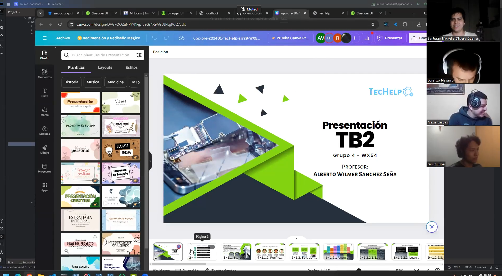

# Conclusiones
## Conclusiones y recomendaciones
1. **CONCLUSIONES:**
- Un buen conocimiento y entendimiento sobre la arquitectura de los API REST ayuda al desarrollo de la backend.
- Una buena elaboración de los diagramas C4 contribuye significativamente al desarrollo más preciso de la backend.
- La elaboración final del sprint 4, a pesar de las complicaciones, pudo desplegarse de manera exitosa.
- Gracias al buen conocimiento adquirido y la buena comunicación grupal a lo largo del ciclo, se pudo desarrollar satisfactoriamente el proyecto.
- **Integración continua y despliegue continuo (CI/CD):** La implementación de una estrategia de CI/CD permitió un despliegue más ágil y eficiente de los cambios en la backend, asegurando que cada actualización pasara por un proceso de pruebas automatizadas antes de ser implementada en producción.
- **Documentación detallada:** La creación y mantenimiento de una documentación detallada para la API REST facilitó la comprensión y el uso de los endpoints por parte de los desarrolladores front-end, resultando en una mejor integración y colaboración entre equipos.
- **Uso de patrones de diseño:** La aplicación de patrones de diseño específicos para la arquitectura de la backend, como el patrón de repositorio y el patrón de controlador, contribuyó a un código más modular y mantenible.
- **Testing exhaustivo:** La implementación de pruebas unitarias y de integración fue clave para identificar y corregir errores tempranamente, mejorando la calidad del código y reduciendo el tiempo de corrección de bugs.
- **Escalabilidad y rendimiento:** Se tomaron en cuenta principios de diseño escalable desde el inicio, lo que permitió que la backend pudiera manejar una mayor carga sin problemas significativos de rendimiento.
- **Manejo de errores:** Se estableció una estrategia robusta para el manejo de errores y excepciones, mejorando la estabilidad y la experiencia del usuario al interactuar con la API.
- **Seguridad:** La implementación de buenas prácticas de seguridad, como la autenticación y autorización adecuadas, el uso de HTTPS, y la protección contra ataques comunes como inyecciones SQL y CSRF, fue fundamental para asegurar los datos y servicios de la aplicación.
- **Optimización de consultas:** La optimización de las consultas a la base de datos mejoró significativamente los tiempos de respuesta de la API, traduciéndose en una mejor experiencia de usuario.
- **Colaboración y uso de herramientas:** El uso de herramientas colaborativas como JIRA para el seguimiento de tareas, Git para el control de versiones y Slack para la comunicación instantánea, mejoró la coordinación del equipo y la gestión del proyecto.
- **Feedback continuo:** El feedback constante de los usuarios y stakeholders permitió ajustar y mejorar continuamente la backend, alineando el desarrollo con las necesidades reales y expectativas del cliente.
- **Capacitación y formación continua:** La inversión en la capacitación y formación continua del equipo en tecnologías y metodologías relevantes contribuyó a mejorar la eficiencia y la calidad del desarrollo.
- **Gestión de la deuda técnica:** Se gestionó de manera proactiva la deuda técnica, priorizando la refactorización del código cuando fue necesario, lo que ayudó a mantener la salud del código a largo plazo.
  
2. **RECOMENDACIONES:**
- **Mantener la documentación actualizada:** Asegúrate de que la documentación de la API REST esté siempre actualizada para facilitar el trabajo de los desarrolladores y mejorar la integración con otros sistemas.
- **Mejorar la cobertura de pruebas:** Incrementa la cobertura de pruebas unitarias y de integración para detectar y corregir errores más temprano en el proceso de desarrollo.
- **Adoptar una arquitectura orientada a microservicios:** Considera la posibilidad de migrar a una arquitectura de microservicios para mejorar la escalabilidad y la capacidad de mantenimiento de la aplicación.
- **Optimizar el rendimiento de la base de datos:** Realiza revisiones periódicas y optimizaciones de las consultas a la base de datos para asegurar un rendimiento óptimo.
- **Automatizar más procesos:** Implementa más herramientas de automatización para tareas repetitivas y propensas a errores, como la implementación de infraestructura como código (IaC) y más scripts de despliegue automatizado.
- **Incorporar análisis de seguridad continuos:** Realiza análisis de seguridad de forma continua para identificar y mitigar posibles vulnerabilidades en la aplicación.
- **Monitoreo y alertas:** Implementa herramientas de monitoreo y sistemas de alertas para detectar problemas en tiempo real y responder rápidamente a cualquier incidencia.
- **Fomentar la capacitación continua:** Invierte en la capacitación continua del equipo en nuevas tecnologías y metodologías de desarrollo para mantener al equipo actualizado y eficiente.
- **Realizar revisiones de código:** Implementa un proceso de revisiones de código (code reviews) regular para mejorar la calidad del código y fomentar el aprendizaje entre los miembros del equipo.
- **Mejorar la gestión del ciclo de vida de las APIs:** Adopta prácticas para gestionar de manera eficiente el ciclo de vida de las APIs, incluyendo la versionado, la depreciación y la documentación de cambios.
- **Aprovechar el feedback de usuarios:** Continúa recolectando y utilizando el feedback de los usuarios para guiar el desarrollo y priorizar las mejoras y nuevas funcionalidades.
- **Adoptar metodologías ágiles:** Si no lo has hecho ya, considera adoptar metodologías ágiles como Scrum o Kanban para mejorar la gestión de proyectos y la colaboración del equipo.
- **Implementar una estrategia de backups:** Asegúrate de tener una estrategia de backups robusta y probada para evitar la pérdida de datos importantes.
- **Evaluar y actualizar tecnologías:** Revisa y actualiza periódicamente las tecnologías y herramientas utilizadas en el proyecto para asegurarte de estar utilizando las más adecuadas y eficientes.
- **Mejorar la comunicación:** Fomenta una comunicación abierta y continua entre los diferentes equipos involucrados en el proyecto para asegurar una colaboración efectiva y resolver problemas rápidamente.

# Video About-the-Team
- **Link del video:** https://upcedupe-my.sharepoint.com/:v:/g/personal/u202113256_upc_edu_pe/EVIqJXaeWaVDivyGAIsHs3EB5KaxoyKZOR4iyfGjoxlNTg?e=sW6Mfq&nav=eyJyZWZlcnJhbEluZm8iOnsicmVmZXJyYWxBcHAiOiJTdHJlYW1XZWJBcHAiLCJyZWZlcnJhbFZpZXciOiJTaGFyZURpYWxvZy1MaW5rIiwicmVmZXJyYWxBcHBQbGF0Zm9ybSI6IldlYiIsInJlZmVycmFsTW9kZSI6InZpZXcifX0%3D

# Bibliografía
> Babiloni, A. (8 de febrero de 2019). ¿Cómo es el servicio técnico de los fabricantes de móviles? Ponemos a prueba el soporte de Apple, Samsung, Xiaomi, LG, Sony y más. Xataka. Recuperado de: https://www.xataka.com/especiales/como-servicio-tecnico-fabricantes-moviles-ponemos-a-prueba-soporte-apple-samsung-xiaomi-lg-sony [Consulta: 05 de Junio de 2024]

> Claro Perú. (10 de agosto 2021). ¿Cómo puedo saber el estado de mi equipo en el Servicio Técnico? Comunidad Claro. Recuperado de: https://comunidad.claro.com.pe/t5/M%C3%B3vil/C%C3%B3mo-puedo-saber-el-estado-de-mi-equipo-en-el-Servicio-T%C3%A9cnico/m-p/69375#M33452 [Consulta: 31 de Mayo de 2024]

> DescoCaosTV (5 de enero de 2020). Pongo a prueba dos técnicos de celular [Archivo de video]. Recuperado de: https://youtu.be/Okmfu74-ebE [Consulta: 19 de Mayo de 2024]

# Anexos
- **Link del Wireframe - (4.3.1. Landing Page Wireframe):** https://www.figma.com/file/qEeQfR7TgOm7D6NDDUFuTL/Open-Source-Gupo-4?type=design&node-id=6%3A2&mode=design&t=dlRqpuWuys2rDtd5-1
- **Link del Mockup - (4.3.2. Landing Page Mock-up):** https://www.figma.com/file/qEeQfR7TgOm7D6NDDUFuTL/Open-Source-Gupo-4?type=design&node-id=6%3A2&mode=design&t=dlRqpuWuys2rDtd5-1
- **Link Wireframes - (4.4.1. Web Applications Wireframes):** https://www.figma.com/file/qEeQfR7TgOm7D6NDDUFuTL/Open-Source-Gupo-4?type=design&node-id=6%3A2&mode=design&t=dlRqpuWuys2rDtd5-1
- **Link Wireframes - (4.4.2. Web Applications Wireflow Diagrams):** https://lucid.app/lucidchart/6a71abb9-a4a6-4ee8-8189-09f15084bbc3/edit?viewport_loc=-571915%2C-43270%2C2675%2C2830%2C0_0&invitationId=inv_1d5bd5a1-9fa6-4c0a-a55c-3ee68b5850a2
- **Link Mock-ups - (4.4.3. Web Applications Mock-ups):** https://www.figma.com/design/VmYMujZZJwXnC90bMDYoLZ/Open-Source-Gupo-4-(actualizado)?node-id=6-2&t=rJDhlETw7ZrXBMFY-0
- **Link Prototyping - (4.5. Web Applications Prototyping):** https://www.figma.com/proto/9U0r61ZoDHjQf7Ck7zotUL/Prototype-TecHelp-APP?type=design&node-id=1-3234&t=HruT40GoBdMnazGq-1&scaling=min-zoom&page-id=0%3A1&starting-point-node-id=1%3A3234&show-proto-sidebar=1&mode=design
- **4.7.1. Class Diagrams:** https://lucid.app/lucidchart/667477fb-235b-4eb3-9565-e1784ea10efa/edit?viewport_loc=-1946%2C-1960%2C5713%2C2716%2C0_0&invitationId=inv_a6dd4c01-7a29-4da7-8688-209bb0e06f14
- **URL de la organización:** https://github.com/OpenSource-Grupo4
- **URL del repositorio del Project-Report :** https://github.com/OpenSource-Grupo4/Project-Report-2
- **URL del repositorio de Landing Page:** https://github.com/OpenSource-Grupo4/LandingPageTechHelpG4.github.io
- **URL del repositorio del FrontEnd:** https://github.com/OpenSource-Grupo4/techelp-frontend
- **URL del repositorio del BackEnd:** https://github.com/OpenSource-Grupo4/techhelp-backend
- **LANDING PAGE DESLPLEGADO:** https://opensource-grupo4.github.io/LandingPageTechHelpG4.github.io/
- **FRONT-END DESLPLEGADO:** https://finaltechhelp.web.app/

- **NEEDFINDING INTERVIEWS:** https://upcedupe-my.sharepoint.com/:v:/g/personal/u202113256_upc_edu_pe/EZTp1-pO-yBEuzwcpbw1UBgBQU1c4L9ECuThnbLOygbvvQ?e=F5Autf&nav=eyJyZWZlcnJhbEluZm8iOnsicmVmZXJyYWxBcHAiOiJTdHJlYW1XZWJBcHAiLCJyZWZlcnJhbFZpZXciOiJTaGFyZURpYWxvZy1MaW5rIiwicmVmZXJyYWxBcHBQbGF0Zm9ybSI6IldlYiIsInJlZmVycmFsTW9kZSI6InZpZXcifX0%3D
- **PROTOTYPES NAVIGATION/PRODUCT NAVIGATION:** https://upcedupe-my.sharepoint.com/:v:/g/personal/u202113256_upc_edu_pe/EV8OjlszK8ZPg4PFh7C15okB7I3HJ3AIKUiiyILWv8usrg?nav=eyJyZWZlcnJhbEluZm8iOnsicmVmZXJyYWxBcHAiOiJPbmVEcml2ZUZvckJ1c2luZXNzIiwicmVmZXJyYWxBcHBQbGF0Zm9ybSI6IldlYiIsInJlZmVycmFsTW9kZSI6InZpZXciLCJyZWZlcnJhbFZpZXciOiJNeUZpbGVzTGlua0NvcHkifX0&e=9HavN6
- **VALIDATION INTERVIEWS:** https://upcedupe-my.sharepoint.com/:v:/g/personal/u202113256_upc_edu_pe/EQJTRnb2czBIgPmpCsJFZqYBELOAcas9s0PgKHzUOgeeFA?nav=eyJyZWZlcnJhbEluZm8iOnsicmVmZXJyYWxBcHAiOiJPbmVEcml2ZUZvckJ1c2luZXNzIiwicmVmZXJyYWxBcHBQbGF0Zm9ybSI6IldlYiIsInJlZmVycmFsTW9kZSI6InZpZXciLCJyZWZlcnJhbFZpZXciOiJNeUZpbGVzTGlua0NvcHkifX0&e=uh2uXi
- **ABOUT-THE-PRODUCT:** https://upcedupe-my.sharepoint.com/:v:/g/personal/u202113256_upc_edu_pe/EXSnYpkPXPFBonszLMn8h3UBRrnDxlVcV99Mh3D7r5iWCg?nav=eyJyZWZlcnJhbEluZm8iOnsicmVmZXJyYWxBcHAiOiJPbmVEcml2ZUZvckJ1c2luZXNzIiwicmVmZXJyYWxBcHBQbGF0Zm9ybSI6IldlYiIsInJlZmVycmFsTW9kZSI6InZpZXciLCJyZWZlcnJhbFZpZXciOiJNeUZpbGVzTGlua0NvcHkifX0&e=D45Sqy
- **ABOUT THE TEAM:** https://upcedupe-my.sharepoint.com/:v:/g/personal/u202113256_upc_edu_pe/EVIqJXaeWaVDivyGAIsHs3EB5KaxoyKZOR4iyfGjoxlNTg?nav=eyJyZWZlcnJhbEluZm8iOnsicmVmZXJyYWxBcHAiOiJPbmVEcml2ZUZvckJ1c2luZXNzIiwicmVmZXJyYWxBcHBQbGF0Zm9ybSI6IldlYiIsInJlZmVycmFsTW9kZSI6InZpZXciLCJyZWZlcnJhbFZpZXciOiJNeUZpbGVzTGlua0NvcHkifX0&e=qipeh8
