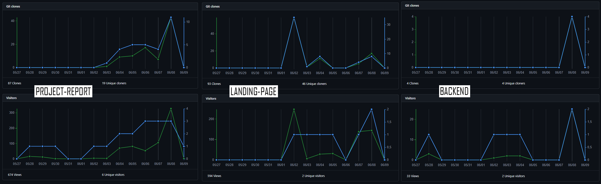

# REGISTRO DE VERSIONES DEL INFORME
----
| Versión | Fecha   | Autor   | Descripción de modificación                                               |
|---------|---------|---------|---------------------------------------------------------------------------|
|TB1|31/03/24|Grupo 4|  - Realización completa de los capítulos: I, II, III, IV y V/Realización 1ra versión del LandingPage |
|TP|20/04/24|Grupo 4|  - Sprint 2/Realización 1ra versión del FrontEnd |
|TB2|17/05/24|Grupo 4|  - Sprint 3/Realización 1ra versión del BackEnd y versión final del FrontEnd |
|TF|16/06/24|Grupo 4|  - Sprint 4/Realización versión final del BackEnd |

# PROJECT REPORT COLLABORATION INSIGHTS
-----
|**`LINK'S DIRECTOS`**|
|-|
|**URL de la organización:** [Grupo 4](https://github.com/OpenSource-Grupo4) - *https://github.com/OpenSource-Grupo4*|
|**URL del repositorio del Project-Report :** [Grupo 4](https://github.com/OpenSource-Grupo4/Project-Report-2) - *https://github.com/OpenSource-Grupo4/Project-Report-2*|
|**URL del repositorio de Landing Page:** [LandingPage](https://github.com/OpenSource-Grupo4/LandingPageTechHelpG4.github.io) - *https://github.com/OpenSource-Grupo4/LandingPageTechHelpG4.github.io*|
|**URL del repositorio del FrontEnd:** [FrontEnd](https://github.com/OpenSource-Grupo4/techelp-frontend) - *https://github.com/OpenSource-Grupo4/techelp-frontend*|
|**URL del repositorio del BackEnd:** [BackEnd](https://github.com/OpenSource-Grupo4/techhelp-backend) - *https://github.com/OpenSource-Grupo4/techhelp-backend*|

|**`REPORTE DE COLABORACIÓN DE LA ENTREGA DE TB1`**|
|---|
|En esta entrega, nuestra tarea principal fue el completar el reporte del proyecto hasta los puntos indicados (Capitulo V) y una primera versión del Landing-Page - adjuntamos los commit's que hicimos para el Project-Report y Landing-Page - Para llevar a cabo este objetivo, hicimos uso de diversas herramientas como GitHub, WebStorm y JavaScript/HTML/CSS. A continuación, vamos a presentar los diagramas de flujo que representan los commits realizados por cada miembro del equipo TecHelp:|
||
En la imagen se evidencia el gráfico de barras de la cantidad de commits realizadas por cada uno de los integrantes del equipo.|
||
|En esta imagen, se ofrece una representación visual de las fechas en las que se llevaron a cabo cambios en el repositorio, junto con la cantidad de modificaciones realizadas en cada uno de los commits. Esta representación gráfica es una herramienta valiosa para comprender la evolución temporal del proyecto y la intensidad del desarrollo a lo largo del tiempo.|
||
|Estos gráficos ofrecen una representación visual de las clonaciones registradas en nuestro repositorio, junto con la fecha en que cada una de estas acciones se llevó a cabo. Además, se presenta información sobre la cantidad de visitantes que ha tenido el repositorio de nuestro equipo a lo largo del tiempo.|
||

|**`REPORTE DE COLABORACIÓN DE LA ENTREGA DE TP`**|
|---|
|En esta entrega, nuestro enfoque fue el mejorar el reporte del proyecto (Sprint 2), junto a la versión final del LandingPage y asimismo adjuntar una primera versión de nuestro FrontEnd - adjuntamos los commit's que hicimos para el Project-Report y Landing-Page y el ya mencionado, FrontEnd - Para llevar a cabo este objetivo, hicimos uso de diversas herramientas como GitHub, WebStorm, 	TypeScript y JavaScript/HTML/CSS. A continuación, vamos a presentar los diagramas de flujo que representan los commits realizados por cada miembro del equipo TecHelp:|
||
En la imagen se evidencia el gráfico de barras de la cantidad de commits realizadas por cada uno de los integrantes del equipo.|
||
|En esta imagen, se ofrece una representación visual de las fechas en las que se llevaron a cabo cambios en el repositorio, junto con la cantidad de modificaciones realizadas en cada uno de los commits. Esta representación gráfica es una herramienta valiosa para comprender la evolución temporal del proyecto y la intensidad del desarrollo a lo largo del tiempo.|
||
|Estos gráficos ofrecen una representación visual de las clonaciones registradas en nuestro repositorio, junto con la fecha en que cada una de estas acciones se llevó a cabo. Además, se presenta información sobre la cantidad de visitantes que ha tenido el repositorio de nuestro equipo a lo largo del tiempo.|
||

|**`REPORTE DE COLABORACIÓN DE LA ENTREGA DE TB2`**|
|---|
|En esta entrega, nuestro enfoque fue el mejorar el reporte del proyecto (Sprint 3), junto a la versión final del FrontEnd y asimismo adjuntar una primera versión de nuestro BackEnd - adjuntamos los commit's que hicimos para el Project-Report y FrontEnd y el ya mencionado, BackEnd - Para llevar a cabo este objetivo, hicimos uso de diversas herramientas como GitHub, WebStorm, TypeScript y JavaScript/HTML/CSS. A continuación, vamos a presentar los diagramas de flujo que representan los commits realizados por cada miembro del equipo TecHelp:|
||
En la imagen se evidencia el gráfico de barras de la cantidad de commits realizadas por cada uno de los integrantes del equipo.|
||
|En esta imagen, se ofrece una representación visual de las fechas en las que se llevaron a cabo cambios en el repositorio, junto con la cantidad de modificaciones realizadas en cada uno de los commits. Esta representación gráfica es una herramienta valiosa para comprender la evolución temporal del proyecto y la intensidad del desarrollo a lo largo del tiempo.|
||
|Estos gráficos ofrecen una representación visual de las clonaciones registradas en nuestro repositorio, junto con la fecha en que cada una de estas acciones se llevó a cabo. Además, se presenta información sobre la cantidad de visitantes que ha tenido el repositorio de nuestro equipo a lo largo del tiempo.|
||

|**`REPORTE DE COLABORACIÓN DE LA ENTREGA DE TF`**|
|---|
|En esta entrega, nuestro enfoque fue el mejorar el reporte del proyecto (Sprint 4), junto a la versión final del BackEnd - adjuntamos los commit's que hicimos para el Project-Report y el ya mencionado, BackEnd - Para llevar a cabo este objetivo, hicimos uso de diversas herramientas como GitHub, WebStorm, TypeScript y JavaScript/HTML/CSS. A continuación, vamos a presentar los diagramas de flujo que representan los commits realizados por cada miembro del equipo TecHelp:|
||
En la imagen se evidencia el gráfico de barras de la cantidad de commits realizadas por cada uno de los integrantes del equipo.|
||
|En esta imagen, se ofrece una representación visual de las fechas en las que se llevaron a cabo cambios en el repositorio, junto con la cantidad de modificaciones realizadas en cada uno de los commits. Esta representación gráfica es una herramienta valiosa para comprender la evolución temporal del proyecto y la intensidad del desarrollo a lo largo del tiempo.|
||
|Estos gráficos ofrecen una representación visual de las clonaciones registradas en nuestro repositorio, junto con la fecha en que cada una de estas acciones se llevó a cabo. Además, se presenta información sobre la cantidad de visitantes que ha tenido el repositorio de nuestro equipo a lo largo del tiempo.|
||

# TABLA DE CONTENIDO
-----

# STUDENT OUTCOME
-----

